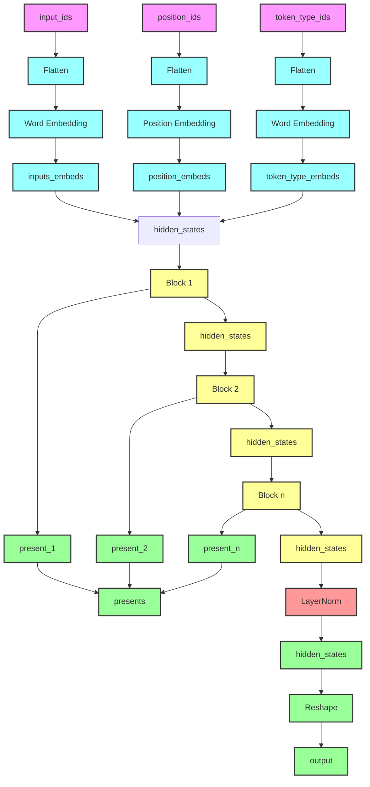
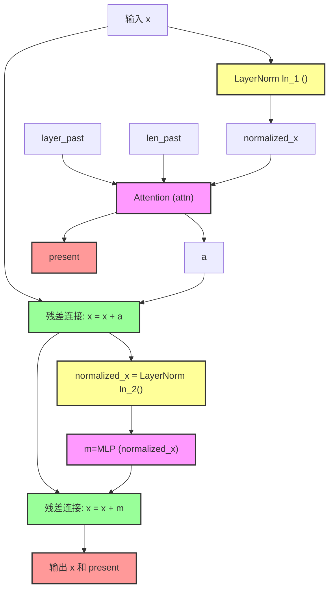
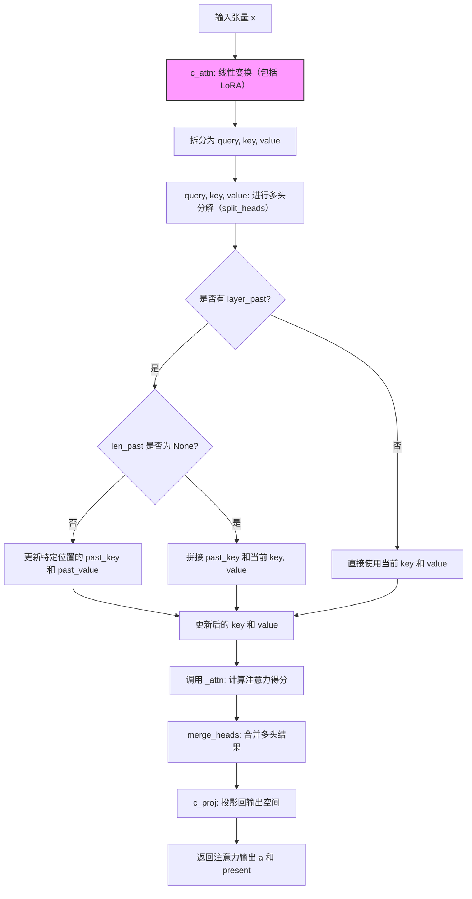
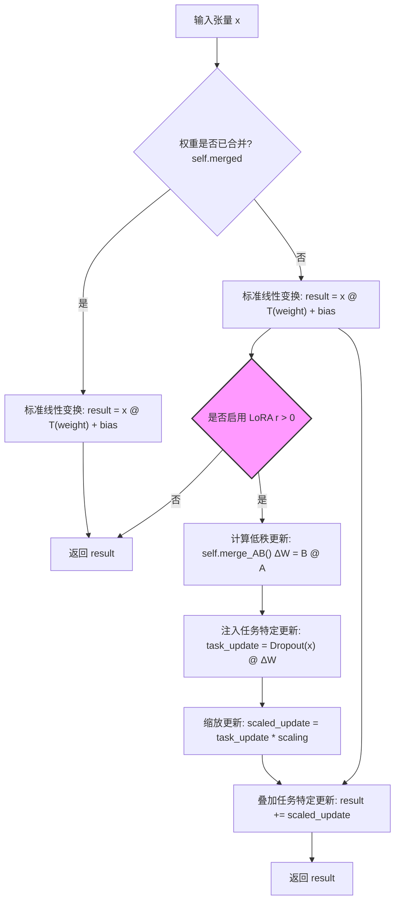
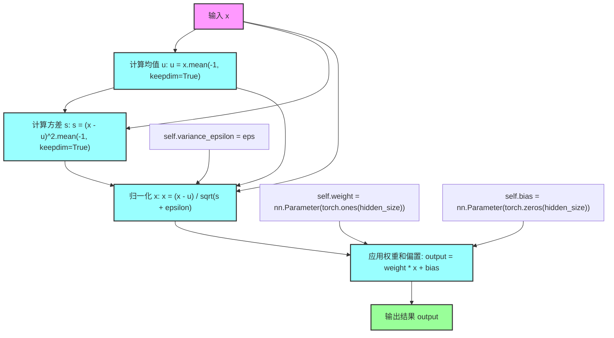
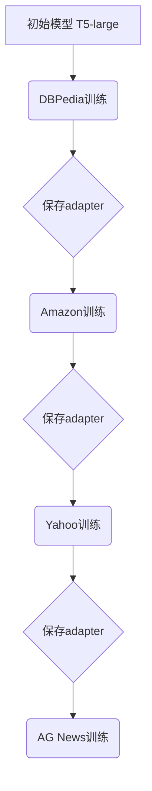

# Paper Reading 18  LLM finetuning and forgetting - 5 Orthogonal subspace


这里介绍一篇论文

Orthogonal Subspace Learning for Language Model Continual Learning

其主要使用了两个主要的概念 Orthogonal Gradient Descent  和 LoRA  vector space 

在介绍这篇论文之前，我首先介绍一下 Orthogonal Gradient Descent 的论文。


下面是论文列表

# 论文列表

- **Orthogonal Gradient Descent for Continual Learning**

  [`semanticscholar`](https://www.semanticscholar.org/paper/841c970f7ef35e28dbbe054d0a7c5df252533a4e)  [`Paper`](https://www.semanticscholar.org/paper/841c970f7ef35e28dbbe054d0a7c5df252533a4e)    

  ​     

- **Orthogonal Subspace Learning for Language Model Continual Learning**

  [`semanticscholar`](https://www.semanticscholar.org/paper/28fde851680a40fbbc5c6a44bd3ac6f5ca4ad284)  [`Paper`](https://www.semanticscholar.org/paper/28fde851680a40fbbc5c6a44bd3ac6f5ca4ad284)    

  2023    Conference on Empirical Methods in Natural Language Processing 


- **Is Parameter Collision Hindering Continual Learning in LLMs?**

  [`semanticscholar`](https://www.semanticscholar.org/paper/f852e60dd32dc1f3f1f53ba8f76862f77c5cd8d2)  [`Paper`](https://www.semanticscholar.org/paper/f852e60dd32dc1f3f1f53ba8f76862f77c5cd8d2)    

  ​     


# 论文前序1  -- QGD

- **Orthogonal Gradient Descent for Continual Learning**

  [`semanticscholar`](https://www.semanticscholar.org/paper/841c970f7ef35e28dbbe054d0a7c5df252533a4e)  [`Paper`](https://www.semanticscholar.org/paper/841c970f7ef35e28dbbe054d0a7c5df252533a4e)    

  ​     


## AI QA ---Summary the paper

Here is a comprehensive summary and analysis of the paper titled *Orthogonal Gradient Descent for Continual Learning* by Mehrdad Farajtabar, Navid Azizan, Alex Mott, and Ang Li:

### Main Content

#### **Scope and Setting**

The paper addresses the challenge of catastrophic forgetting in neural networks during continual learning (CL), where models trained sequentially on tasks forget previously learned knowledge.

#### **Purpose**

The aim is to propose a method that allows neural networks to retain prior knowledge effectively while learning new tasks, without needing to revisit or store old data.

#### **Key Idea**

The authors introduce the Orthogonal Gradient Descent (OGD) method. This approach modifies the direction of gradient updates to minimize interference with gradients associated with previous tasks.

#### **Method**

1. **Gradient Orthogonalization**: The gradients of new tasks are projected orthogonally to the subspace spanned by gradients of previous tasks, ensuring minimal disruption to prior knowledge.
2. **Memory Efficiency**: Only a subset of gradients from previous tasks is stored, mitigating storage requirements.
3. **Variants**:
   - **OGD-ALL**: Stores gradients for all logits.
   - **OGD-AVE**: Stores average gradients of logits.
   - **OGD-GTL**: Stores gradients for the ground truth logits (used in experiments).

#### **Contributions**

1. A novel method (OGD) to mitigate catastrophic forgetting.
2. Empirical evaluation on benchmarks (Permuted MNIST, Rotated MNIST, Split MNIST) showing state-of-the-art performance.
3. A method that is privacy-friendly by not requiring storage of raw data.

#### **Difference and Innovation**

OGD differs from other methods by working with model prediction gradients rather than loss gradients. This approach ensures better preservation of prior task knowledge and avoids problems like loss gradients becoming zero for well-fitted examples.

#### **Results and Conclusion**

- OGD performs competitively with and often exceeds state-of-the-art methods like A-GEM and EWC on various benchmarks.
- The method is robust in settings where tasks are similar but struggles when tasks are highly dissimilar (e.g., large rotations in Rotated MNIST).
- OGD requires careful tuning of the learning rate but provides a promising avenue for scalable and memory-efficient continual learning.

### Comparison with Other Methods

| Method | Storage Needs          | Gradient Basis       | Performance on CL Benchmarks              |
| ------ | ---------------------- | -------------------- | ----------------------------------------- |
| EWC    | Moderate               | Fisher Information   | Sensitive to overparameterization         |
| A-GEM  | High (stores raw data) | Loss gradients       | Competitive but requires data storage     |
| OGD    | Low (stores gradients) | Prediction gradients | Strong overall, especially on Split MNIST |

### Discussion

- **Advantages**: OGD does not require raw data storage, preserving user privacy and making it suitable for sensitive applications.
- **Limitations**: Performance degrades when tasks are highly dissimilar, and it is sensitive to large learning rates.
- **Future Directions**: Exploring high-order derivatives, better gradient storage prioritization, and extending the method to adaptive optimizers like Adam.

------

### Summary Table of Base Models and Datasets

| Model Architecture | Model Size          | Dataset        | Tasks                   |
| ------------------ | ------------------- | -------------- | ----------------------- |
| 3-layer MLP        | 100 units per layer | Permuted MNIST | Sequential Permutations |
| 3-layer MLP        | 100 units per layer | Rotated MNIST  | Rotation by angle       |
| Multi-head MLP     | 100 units per layer | Split MNIST    | Disjoint label sets     |

Let me know if you need further details or analysis.


## AI QA---Introduce the 3 variants 

In the context of the paper and neural networks, **logits** are the raw, unnormalized outputs of the last layer of the model, typically a fully connected layer. For a classification problem, logits represent the model's prediction scores for each class before applying an activation function like softmax.

### Key Definitions of Variants

The paper proposes three variants of the Orthogonal Gradient Descent (OGD) method, differing in which gradients are stored and how they are used:

1. **OGD-ALL**
   - **What it stores**: The gradients for all logits (scores for all classes).
   - **Key characteristic**: Maintains maximum information about the model’s prediction changes for all possible outputs.
   - **Memory Usage**: High, as it stores gradient vectors for all classes.
2. **OGD-AVE**
   - **What it stores**: The averaged gradients across all logits.
   - **Key characteristic**: Reduces memory requirements by summarizing the gradients, effectively losing fine-grained information about individual class scores.
   - **Memory Usage**: Lower than OGD-ALL.
3. **OGD-GTL (Ground Truth Logit)**
   - **What it stores**: The gradient for the logit corresponding to the ground truth class only (the class label of the given sample).
   - **Key characteristic**: Focuses exclusively on the gradient for the correct class, discarding information about other classes.
   - **Memory Usage**: Lowest among the three, as it stores only one gradient per data point.

### Differences Between the Variants and the Proposed Method

- **Storage Efficiency**:
  - OGD-GTL is the most memory-efficient as it focuses solely on the ground truth class gradient.
  - OGD-ALL is memory-intensive, storing gradients for all logits, which scales with the number of classes.
  - OGD-AVE balances memory usage by summarizing information but sacrifices specificity.
- **Performance**:
  - **OGD-ALL**: Best at preserving comprehensive model knowledge but requires significant storage, which may not be practical for many tasks.
  - **OGD-AVE**: May lose performance compared to the other variants due to the reduction in stored information, especially for more complex tasks.
  - **OGD-GTL**: Offers a good trade-off, showing comparable or slightly better performance than OGD-ALL in many experiments while requiring significantly less memory.
- **Applicability**:
  - **OGD-GTL** is favored in the paper for practical experiments because it maintains strong performance while being memory-efficient.

### Comparison with the Original OGD Proposal

The **original OGD method** does not inherently specify which gradients (logits, averages, or ground truth) to store; it focuses on the orthogonalization of the gradient updates. These three variants implement OGD differently based on the choice of gradients to store, optimizing for various trade-offs in memory and performance.

Let me know if you need a deeper explanation of logits, orthogonalization, or other aspects!


## AI---QA Clarity the Figure 1 design


To address your question based on the paper's content and Figure 1:

### Ensuring Subspace Orthogonality

The method ensures the subspace of Task A remains orthogonal to Task B by projecting the gradients for Task B onto the orthogonal complement of the gradient subspace of Task A. The process is as follows:

1. **Gradient Storage from Task A**:

   - During training on Task A, the gradients of the model predictions (`rf(x; w)`) are computed and stored for all or a subset of samples from Task A.
   - This forms a gradient subspace that represents the directions in parameter space critical for retaining knowledge of Task A.

2. **Orthogonal Projection for Task B**:

   - When Task B arrives, the loss gradients (`g`) are computed for the current task.

   - Before applying these gradients to update the model, they are projected onto the orthogonal complement of Task A's gradient subspace: 

     

   - $$
     \tilde{g} = g - \sum_{v \in S} \text{proj}_v(g),
     $$

     

     where SS is the set of stored gradients from Task A, and $\text{proj}_v(g)$ projects gg onto the direction $v$.

   - This ensures that updates for Task B minimally interfere with the gradients crucial for retaining Task A's knowledge.

### Can the Model Still Learn to Classify if the Gradient Changes?

Yes, the model can still learn to classify Task B even with the modified gradients. Here’s why:

1. **Preservation of Task A Knowledge**:

   - By projecting Task B's gradients orthogonally, the model avoids altering directions in parameter space that are critical for Task A. This minimizes forgetting while leaving enough capacity for Task B.

2. **Learning New Information**:

   - The projected gradient g~\tilde{g} is still a valid descent direction for Task B's loss function. This is because the projection only removes components that interfere with Task A, retaining components that contribute to learning Task B: 

   - 

   - $$
     \langle -\tilde{g}, g \rangle \leq 0, 
     $$

     

     which ensures that moving in the direction of g~\tilde{g} decreases Task B’s loss.

3. **Capacity Utilization**:

   - Neural networks are typically overparameterized, meaning there are sufficient degrees of freedom in the parameter space to satisfy the orthogonality constraint while still learning new tasks.

### Intuition from Figure 1

Figure 1 illustrates this concept: the original gradient gg from Task B is modified to g~\tilde{g}, which lies in the blue subspace orthogonal to Task A's gradient directions. Moving within this orthogonal subspace allows the model to learn Task B while ensuring predictions for Task A remain stable.

### Potential Challenges

- If the tasks are highly dissimilar (e.g., rotations >90° in Rotated MNIST), the orthogonal subspace may contain limited useful directions for Task B. In such cases, learning new tasks while retaining old ones becomes more challenging.

This approach balances learning and retention effectively in most scenarios while exploiting the high capacity of neural networks.


In the context of the paper, **orthogonal** refers specifically to the gradients and not the feature embeddings. Here's a breakdown:

### What Does Orthogonal Mean Here?

1. **Orthogonal Gradients**:

   - The concept of orthogonality in this paper applies to the **gradients** of the model's predictions with respect to its parameters.
   - When the paper says Task A and Task B are "orthogonal," it means that the gradient updates for Task B are projected onto a subspace that is orthogonal to the subspace spanned by the gradients of Task A.
   - This ensures that the updates for Task B do not interfere with the directions in the parameter space that are critical for retaining knowledge about Task A.

2. **Key Equation**: The paper formalizes this by requiring:

   
   $$
   \tilde{g} \perp \text{span}\left(\{\nabla f_j(x; w^*_A)\}\right), \forall x \in T_A, j \in [1, c],
   $$
   

   where $\nabla f_j(x; w^*_A)$ represents the gradient of the logit jj for input xx in Task A.

------

### Is It About Gradients or Feature Embeddings?

It is about **gradients**, not feature embeddings. Specifically:

- **Gradients**: Orthogonality refers to the mathematical property that the gradient directions for Task B are made perpendicular (orthogonal) to the gradient subspace of Task A.
- **Feature Embeddings**: The paper does not explicitly enforce orthogonality between the feature embeddings of Task A and Task B. Instead, the method ensures that the updates to the model parameters for Task B do not interfere with those critical for Task A.

------

### Why Gradients, Not Feature Embeddings?

1. **Gradients Represent Learning Directions**:
   - Gradients directly influence how the model's parameters are updated during backpropagation.
   - By projecting gradients orthogonally, the method directly controls the parameter changes, ensuring minimal interference with Task A.
2. **Feature Embeddings Are Indirect**:
   - While feature embeddings (intermediate representations of input data) might change as the model learns new tasks, the paper does not explicitly manipulate them. Instead, the method works at the gradient level to indirectly preserve task-relevant features.

------

### Intuitive Summary

- **Orthogonality of Gradients**: Ensures that the parameter updates for Task B do not "erase" knowledge relevant to Task A.
- **Feature Embeddings**: May or may not be orthogonal depending on the tasks, but the method does not enforce this explicitly.

If you'd like more details on why gradients are the focus or how embeddings might interact indirectly, feel free to ask!


论文前序2 LoRA

LoRA 的论文这里就不展开介绍，可以看另一篇论文

# 论文前序 LoRA

- **LORA: LOW-RANK ADAPTATION OF LARGE LANGUAGE MODELS**

  [`semanticscholar`](https://www.semanticscholar.org/paper/a8ca46b171467ceb2d7652fbfb67fe701ad86092)  [`Paper`](https://www.semanticscholar.org/paper/a8ca46b171467ceb2d7652fbfb67fe701ad86092)    

  2021    International Conference on Learning Representations 


## AI QA1  **Summary of the Paper: LoRA - Low-Rank Adaptation of Large Language Models**

#### **Main Content Analysis**

1. **Scope/Setting**:
   - Focuses on efficient adaptation of large pre-trained language models (e.g., GPT-3) to downstream tasks without full fine-tuning.
   - Applicable to dense layers in neural networks, particularly in Transformer-based architectures.
   
2. **Purpose**:
   - To reduce the computational and memory overhead associated with fine-tuning large models.
   - Introduces a parameter-efficient method called **LoRA** (Low-Rank Adaptation), which minimizes the number of trainable parameters while maintaining model performance.
   
3. **Key Idea**:
   - Instead of updating all model parameters, LoRA freezes the pre-trained weights and injects trainable **low-rank matrices** into the model to capture task-specific adaptations.
   
4. **Method**:
   - **Low-Rank Decomposition**: The weight update $\Delta W$ is represented as the product of two low-rank matrices: 
     $$
     \Delta W = W_0 + BA 
     $$
     
   
     where $W_0$ is the pre-trained weight, and $B$ and $A$ are trainable matrices with a rank $r$ such that $r \ll d$.
   
   - **No Additional Latency**: The method merges $B$ and $A$ into $W_0$ during inference, eliminating additional computation compared to fine-tuned models.
   
5. **Contributions**:
   - Significantly reduces the number of trainable parameters (e.g., by up to 10,000× compared to full fine-tuning).
   - Enables parameter-efficient task switching with low memory and computational costs.
   - Provides theoretical insights and empirical evidence supporting the low-rank nature of weight updates in large language models.
   
6. **Difference and Innovation**:
   - Unlike adapter-based methods, LoRA does not introduce inference latency as it integrates task-specific parameters directly into the original weights.
   - Orthogonal to existing approaches, allowing potential integration with other techniques (e.g., prefix tuning).
   
7. **Results**:
   - LoRA matches or outperforms full fine-tuning and adapter-based methods on benchmarks like GLUE, WikiSQL, SAMSum, and the E2E NLG Challenge.
   - Demonstrates scalability and task performance across RoBERTa, DeBERTa, GPT-2, and GPT-3.
   
8. **Conclusion**:
   - LoRA offers an efficient and practical solution for adapting large pre-trained models to multiple tasks without the need for full fine-tuning.
   
9. **Discussion**:
   - Highlights potential for combining LoRA with other parameter-efficient techniques.
   - Encourages further exploration into low-rank structures in deep learning.

------

### **Comparison with Other Methods**

| **Aspect**            | **Full Fine-Tuning**          | **Adapters**              | **LoRA**                         |
| --------------------- | ----------------------------- | ------------------------- | -------------------------------- |
| **Trainable Params**  | 100%                          | <1% (added layers)        | 0.01% to 0.1%                    |
| **Inference Latency** | No additional latency         | Increases latency         | No additional latency            |
| **Storage Cost**      | High (one copy per task)      | Moderate (adapter layers) | Very low (small matrices $A, B$) |
| **Scalability**       | Limited by task-specific size | Limited                   | Highly scalable                  |
| **Performance**       | High                          | Varies                    | Matches or exceeds fine-tuning   |

------

### **Base Model and Dataset Summary**

| **Aspect**      | **Details**                                                  |
| --------------- | ------------------------------------------------------------ |
| **Base Models** | - RoBERTa (125M and 355M parameters)                         |
|                 | - DeBERTa (1.5B parameters)                                  |
|                 | - GPT-2 (354M and 774M parameters)                           |
|                 | - GPT-3 (175B parameters)                                    |
| **Datasets**    | - GLUE Benchmark: MNLI, SST-2, MRPC, CoLA, QNLI, QQP, RTE, STS-B. |
|                 | - WikiSQL: Generate SQL queries from natural language questions. |
|                 | - SAMSum: Dialogue summarization dataset.                    |
|                 | - E2E NLG Challenge: End-to-end natural language generation. |
|                 | - DART and WebNLG: Structured data-to-text generation.       |
| **Metrics**     | - Accuracy (e.g., on MNLI, WikiSQL).                         |
|                 | - ROUGE (e.g., for summarization tasks).                     |
|                 | - BLEU, METEOR, CIDEr (e.g., for NLG tasks).                 |
| **Results**     | - Matches or exceeds fine-tuning on most tasks with fewer trainable parameters. |

Let me know if you need further clarification or detailed insights into specific sections!


## 代码实现查看

LoRA 代码地址  [LoRA/examples/NLG at main · microsoft/LoRA](https://github.com/microsoft/LoRA/tree/main/examples/NLG)


### gpt2.py main 函数主要代码

```python
 """配置 LoRA 参数：

        lora_attn_dim：低秩矩阵的秩。
        lora_attn_alpha：缩放因子。
        lora_dropout：dropout 概率。
    """
    if args.model_card == 'gpt2.sm':
        config = GPT2Config(
            n_embd=768, n_layer=12, n_head=12, 
            lora_attn_dim=args.lora_dim, 
            lora_attn_alpha=args.lora_alpha, 
            lora_dropout=args.lora_dropout,
        )
    elif args.model_card == 'gpt2.md':
        config = GPT2Config(
            n_embd=1024, n_layer=24, n_head=16, 
            lora_attn_dim=args.lora_dim, 
            lora_attn_alpha=args.lora_alpha, 
            lora_dropout=args.lora_dropout,
        )
    elif args.model_card == 'gpt2.lg':
        config = GPT2Config(
            n_embd=1280, n_layer=36, n_head=20, 
            lora_attn_dim=args.lora_dim, 
            lora_attn_alpha=args.lora_alpha, 
            lora_dropout=args.lora_dropout,
        )

    """
    创建模型实例：
        在创建模型时，这些 LoRA 参数会被传递给模型配置，并在模型内部进行相应的权重分解。
    """
    lm_net = GPT2LMModel(config)
    if args.init_checkpoint is not None:
        print('loading model pretrained weight.')
        lm_net.load_weight(torch.load(args.init_checkpoint))    

    lm_net = lm_net.cuda()

    """这个函数会将模型中的 LoRA 参数标记为可训练，
        而其他参数则设置为不可训练。
        这样在训练过程中，只有这些低秩矩阵会被更新，从而实现参数的有效减少。"""
    if args.lora_dim > 0:
        lora.mark_only_lora_as_trainable(lm_net)
```


### gpt2.py  class GPT2LMModel(config) 代码


__init__()

```python
def __init__(self, config):
        super(GPT2LMModel, self).__init__()
        self.transformer = GPT2Model(config)
        self.lm_head = GPT2LMHead(self.transformer.wte.weight, config)
        self.apply(self._init_weights)
```


### gpt2.py  class GPT2Model 


```python
def forward(
        self, 
        input_ids, 
        position_ids=None, 
        token_type_ids=None, 
        past=None, 
        len_past=None
    ):
        """
        Forward pass of the GPT2Model.

        Args:
        input_ids (torch.Tensor): Input token indices.
        position_ids (torch.Tensor, optional): Position indices. Defaults to None.
        token_type_ids (torch.Tensor, optional): Token type indices. Defaults to None.
        past (list, optional): Past hidden states for caching. Defaults to None.
        len_past (int, optional): Length of past hidden states. Defaults to None.

        Returns:
        tuple: A tuple containing the final hidden states and a list of present hidden states.

    """
        # 初始化 past 和 past_length
        if past is None:
            past_length = 0
            past = [None] * len(self.h)# 如果 past 为 None，则初始化为 None 列表
        elif len_past is None:
            # 如果 len_past 为 None，则从 past 中获取 past_length
            # equal size for past. []
            past_length = past[0][0].size(-2)

        # 生成 position_ids
        if position_ids is None and len_past is None:
            # 如果 position_ids 和 len_past 都为 None，则生成 position_ids
            position_ids = torch.arange(
                past_length, input_ids.size(-1) + past_length, 
                dtype=torch.long, device=input_ids.device
            )
            position_ids = position_ids.unsqueeze(0).expand_as(input_ids)
        elif len_past is not None:
            # 如果 len_past 不为 None，则生成 position_ids
            position_ids = (len_past).unsqueeze(1) #.long()

        # 获取输入张量的形状，并展平 input_ids 和 position_ids
        input_shape = input_ids.size()
        input_ids = input_ids.view(-1, input_ids.size(-1))
        position_ids = position_ids.view(-1, position_ids.size(-1))

        # 使用词嵌入层将 input_ids 转换为词嵌入张量
        inputs_embeds = self.wte(input_ids)     

        # 使用位置嵌入层将 position_ids 转换为位置嵌入张量
        position_embeds = self.wpe(position_ids)

        # 处理 token_type_ids
        if token_type_ids is not None:
            token_type_ids = token_type_ids.view(-1, token_type_ids.size(-1))
            token_type_embeds = self.wte(token_type_ids)  # 使用词嵌入层将 token_type_ids 转换为 token 类型嵌入张量
        else:
            token_type_embeds = 0 # 如果 token_type_ids 为 None，则 token_type_embeds 设为 0

        # 将词嵌入、位置嵌入和 token 类型嵌入相加，得到初始的隐藏状态
        hidden_states = inputs_embeds + position_embeds + token_type_embeds

        # 初始化 presents 列表，用于存储每个 Block 的隐藏状态
        presents = []
        for block, layer_past in zip(self.h, past):
            # 将当前的隐藏状态传递给 Block，并获取更新后的隐藏状态和新的隐藏状态
            hidden_states, present = block(hidden_states, layer_past = layer_past, len_past=len_past)
            presents.append(present)# 将新的隐藏状态添加到 presents 列表中
       
        # 使用层归一化层对最终的隐藏状态进行归一化
        hidden_states = self.ln_f(hidden_states)

        # 计算输出张量的形状
        output_shape = input_shape + (hidden_states.size(-1),)

        # 将隐藏状态重塑为原始输入形状，并返回隐藏状态和 presents 列表
        return hidden_states.view(*output_shape), presents

```





### gpt2.py   class Block(nn.Module):


def forward 

```python
def forward(self, x, layer_past=None, len_past=None):
        """
        Forward pass of the Block module.

        Args:
            x (torch.Tensor): Input tensor.
            layer_past (torch.Tensor, optional): Past hidden states for caching. Defaults to None.
            len_past (int, optional): Length of past hidden states. Defaults to None.

        Returns:
            tuple: A tuple containing the final hidden state and the present hidden state.

        """

        # 使用 LayerNorm 对输入张量 x 进行归一化
        normalized_x = self.ln_1(x)  # LayerNorm (ln_1)

        # 使用 Attention 模块处理归一化后的张量
        a, present = self.attn(normalized_x, layer_past=layer_past, len_past=len_past)  # Attention (attn)

        # 残差连接：将输入张量 x 和注意力输出 a 相加
        x = x + a  # x + a

        # 使用 LayerNorm 对新的隐藏状态 x 进行归一化
        normalized_x = self.ln_2(x)  # LayerNorm (ln_2)

        # 使用 MLP 模块处理归一化后的张量
        m = self.mlp(normalized_x)  # MLP (mlp)

        # 残差连接：将新的隐藏状态 x 和前馈网络输出 m 相加
        x = x + m  # x + m

        # 返回最终的隐藏状态 x 和新的隐藏状态 present
        return x, present  # output x, present
```





### model.py   class Attention


```python
def forward(self, x, history=None, layer_past=None, len_past=None):
        hidden_states = x

        x = self.c_attn(x)
        query, key, value = x.split(self.split_size, dim=2)

        query = self.split_heads(query)
        key = self.split_heads(key, k=True)
        value = self.split_heads(value)

        #_input_msk = None

        len_kv = None

        if layer_past is not None:
            # key : (batch, head, head_features, seq_length)
            # value : (batch, head, seq_length, head_features)
            # layer_past, key : (batch, head, seq_length, head_features)
            if len_past is None:
                past_key, past_value = layer_past[0].transpose(-2, -1), layer_past[1]  # transpose back cf below
                key = torch.cat((past_key, key), dim=-1)
                value = torch.cat((past_value, value), dim=-2)
            else:
                key_seq = key.shape[-1]
                assert key_seq == 1

                _batch = torch.arange(0, key.shape[0], dtype=torch.long, device=key.device)

                past_key, past_value = layer_past[0], layer_past[1]

                past_key[_batch,:,len_past,:] = key.squeeze(-1)
                past_value[_batch,:,len_past,:] = value.squeeze(-2)

                key = past_key.transpose(-2, -1)
                value = past_value

                len_kv = len_past + 1

        present = torch.stack((key.transpose(-2, -1), value))  # transpose to have same shapes for stacking
        a = self._attn(query, key, value, len_kv = len_kv)
        a = self.merge_heads(a)
        a = self.c_proj(a)
        return a, present
```





### loralib layers.py    lora.MergedLinear


```python
def forward(self, x: torch.Tensor):
        """
        The forward pass of the MergedLinear layer.
        MergedLinear 层的前向传播。

        Args:
            x (torch.Tensor): Input tensor with shape (batch_size, seq_len, in_features).
                              输入张量，形状为 (batch_size, seq_len, in_features)。

        Returns:
            torch.Tensor: Output tensor with shape (batch_size, seq_len, out_features).
                          输出张量，形状为 (batch_size, seq_len, out_features)。
        """
        def T(w):
            # Transpose the weight matrix if fan_in_fan_out is True; otherwise, return as is.
            # 如果 fan_in_fan_out 为 True，则转置权重矩阵；否则按原样返回。
            return w.transpose(0, 1) if self.fan_in_fan_out else w

        # Check if LoRA is enabled (r > 0) and weights are not merged
        # 检查是否启用了 LoRA (r > 0) 且权重未合并
        if self.r > 0 and not self.merged:
            # Perform standard linear transformation: result = x @ W^T + bias
            # 执行标准线性变换：result = x @ W^T + bias
            result = F.linear(x, T(self.weight), bias=self.bias)

            # Compute LoRA-specific weight update: ΔW = B @ A
            # 计算 LoRA 特定的权重更新：ΔW = B @ A
            # Inject task-specific updates into the result
            # 将任务特定更新注入到结果中
            result += (self.lora_dropout(x) @ self.lora_A.transpose(0, 1) @ self.lora_B.transpose(0, 1)) * self.scaling

            # Return the final result with LoRA updates
            # 返回包含 LoRA 更新的最终结果
            return result
        else:
            # If LoRA is disabled or weights are merged, perform only the standard linear transformation
            # 如果 LoRA 被禁用或权重已合并，仅执行标准线性变换
            return F.linear(x, T(self.weight), bias=self.bias)

```





**代码片段介绍**

```python
x = self.c_attn(x)
```

这句代码调用了 `self.c_attn`，在本实现中，`self.c_attn` 被定义为 LoRA 的 `MergedLinear` 类的实例，用于替代标准的 `nn.Linear` 层。在调用 `forward` 方法时，`self.c_attn` 对输入张量 `x` 进行处理，完成以下核心功能：

------

**作用详解**

1. **标准线性变换**

   MergedLinear的核心功能类似于标准的 nn.Linear，执行如下线性变换：

   
   $$
   \text{output} = x \cdot W^T + b
   $$
   

   - $x$: 输入张量，形状为$ (\text{batch\_size}, \text{seq\_len}, \text{in\_features})$。
   - $W$: 权重矩阵，形状为 $(\text{out\_features}, \text{in\_features})$。
   - $b$: 偏置向量，形状为 $(\text{out\_features})$。

2. **LoRA 的低秩权重更新**

   - 如果启用了 LoRA（即 $r > 0$ 且未合并权重），则会动态计算任务特定的权重更新：

     
     $$
     \Delta W = B \cdot A
     $$
     

     - $A$: 低秩矩阵，形状为 $(r, \text{in\_features})$。
     - $B$: 低秩矩阵，形状为 $(\text{out\_features}, r)$。
     - $r$: 低秩维度，远小于权重矩阵的维度。

   - 将计算出的权重更新 $\Delta W$ 注入到标准线性变换中：
     $$
     \text{output} = x \cdot W^T + b + x \cdot \Delta W^T
     $$
     

3. **任务特定更新的缩放**

   - 通过 `self.scaling` 对低秩更新进行缩放控制： 

     

   $$
   \Delta W_{\text{scaled}} = \Delta W \cdot \frac{\text{lora\_alpha}}{r}
   $$

   

4. **正则化与防止过拟合**

   - 对输入张量 $x$ 应用 `Dropout`，随机屏蔽部分输入，增强模型的泛化能力。

5. **权重合并机制**

   - 如果权重已合并（`self.merged = True`），直接使用合并后的权重执行标准线性变换，避免额外的计算。

------

**总结作用**

这行代码的作用是通过 `self.c_attn` 完成以下两部分：

1. **标准线性变换**：基于冻结的预训练权重 $W$执行基础的输入映射。
2. **LoRA 低秩更新注入**：根据任务需求动态计算并注入额外的权重更新，提升模型的任务适配能力，同时减少参数量。

通过这行代码，输入张量 `x` 被映射到新的特征空间，生成了任务特定的上下文表示。这是 LoRA 在 Attention 模块中实现参数高效适配的关键步骤。


### gpt2.py   class LayerNorm() 


```python
class LayerNorm(nn.Module):
    def __init__(self, hidden_size, eps=1e-12):
        """Construct a layernorm module in the TF style (epsilon inside the square root)."""
        super(LayerNorm, self).__init__()
        self.weight = nn.Parameter(torch.ones(hidden_size))
        self.bias = nn.Parameter(torch.zeros(hidden_size))
        self.variance_epsilon = eps

    def forward(self, x):
        u = x.mean(-1, keepdim=True)
        s = (x - u).pow(2).mean(-1, keepdim=True)
        x = (x - u) / torch.sqrt(s + self.variance_epsilon)
        return self.weight * x + self.bias
```





# 论文介绍 -- O-LoRA


Orthogonal Subspace Learning for Language Model Continual Learning

- **Orthogonal Subspace Learning for Language Model Continual Learning**

  [`semanticscholar`](https://www.semanticscholar.org/paper/28fde851680a40fbbc5c6a44bd3ac6f5ca4ad284)  [`Paper`](https://www.semanticscholar.org/paper/28fde851680a40fbbc5c6a44bd3ac6f5ca4ad284)    

  2023    Conference on Empirical Methods in Natural Language Processing 


## AI QA --- Summary 

### Summary of the Paper: Orthogonal Gradient Descent for Continual Learning

1. **Scope/Setting**:
   - Focuses on continual learning, specifically addressing catastrophic forgetting in neural networks, where performance on earlier tasks degrades after learning new tasks.
2. **Purpose**:
   - Proposes the Orthogonal Gradient Descent (OGD) method to enable neural networks to learn new tasks without forgetting previously learned tasks.
3. **Key Idea**:
   - Gradient updates for new tasks are projected onto a subspace orthogonal to the gradients of previously learned tasks. This approach minimizes interference with past knowledge while still optimizing for the current task.
4. **Method**:
   - OGD computes and stores gradients related to previous tasks. For new tasks, the gradients are modified to ensure orthogonality with stored gradients using techniques like Gram-Schmidt orthogonalization.
   - Variants like OGD-GTL (gradient on ground truth logit) and OGD-AVE (average gradient) manage memory efficiency.
5. **Contributions**:
   - Avoids catastrophic forgetting without storing past task data, addressing privacy concerns.
   - Efficiently utilizes neural network capacity to balance performance across multiple tasks.
   - Demonstrates competitive performance across standard continual learning benchmarks.
6. **Differences/Innovation**:
   - Unlike existing methods, OGD operates directly on model gradients rather than loss gradients, preserving critical knowledge more effectively.
   - Does not require storing raw past data, making it advantageous in privacy-sensitive applications.
7. **Results**:
   - Outperforms or matches state-of-the-art methods like Elastic Weight Consolidation (EWC) and Averaged Gradient Episodic Memory (A-GEM) on benchmarks such as Permuted MNIST, Rotated MNIST, and Split MNIST.
   - Shows robustness across tasks with minimal forgetting.
8. **Discussion**:
   - Highlights sensitivity to learning rates and the challenges with highly dissimilar tasks.
   - Suggests potential extensions for better memory management and adaptation to higher learning rates.
9. **Comparison to Other Methods**:
   - Compared with SGD, EWC, A-GEM, and Multi-Task Learning (MTL):
     - OGD achieves better balance in retaining past knowledge while learning new tasks.
     - Less reliant on storing or replaying past data, unlike A-GEM or generative replay methods.

------

### Base Model and Dataset Details:

| **Aspect**            | **Details**                                                  |
| --------------------- | ------------------------------------------------------------ |
| **Base Model**        | A three-layer Multilayer Perceptron (MLP) with 100 hidden units per layer, ReLU activation, and 10 output logits for classification. |
| **Dataset(s)**        | Benchmarks for continual learning:                           |
|                       | - **Permuted MNIST**: MNIST digits permuted by different shuffling schemes. |
|                       | - **Rotated MNIST**: MNIST digits rotated by fixed angles.   |
|                       | - **Split MNIST**: Disjoint subsets of MNIST labels for different tasks. |
| **Variants Explored** | OGD-ALL (all logits), OGD-AVE (average logits), and OGD-GTL (ground truth logit). |
| **Optimization**      | Stochastic Gradient Descent (SGD) with a learning rate of 10−310^{-3}. |
| **Storage**           | Gradient storage limited to 200 vectors per task.            |
| **Training**          | Each task trained for 5 epochs, batch size of 10.            |

Let me know if you would like a deeper analysis or specific sections rewritten!


AI QA --- Relation with 

### Summary of the Paper: Orthogonal Subspace Learning for Language Model Continual Learning

#### **Main Content Analysis**

1. **Scope/Setting**:
   - This paper addresses continual learning challenges in large language models (LLMs), focusing on mitigating catastrophic forgetting, which arises when tasks are learned sequentially.
2. **Purpose**:
   - Introduces Orthogonal Low-Rank Adaptation (O-LoRA), a method for efficient and privacy-preserving continual learning in LLMs. It ensures that the knowledge of previous tasks is preserved while learning new ones.
3. **Key Idea**:
   - The method leverages the low-rank adaptation (LoRA) technique to store gradients in orthogonal subspaces for each task, minimizing interference and catastrophic forgetting.
4. **Method**:
   - O-LoRA fixes LoRA parameters for past tasks and enforces orthogonality between gradient subspaces of new and past tasks.
   - Orthogonality is achieved through a constraint in the training objective that penalizes overlapping gradient directions.
5. **Contributions**:
   - Proposes a rehearsal-free and parameter-efficient method for continual learning.
   - Demonstrates the generalization capability of O-LoRA to unseen tasks without requiring task-specific inference.
6. **Differences/Innovation**:
   - Unlike methods that require storing past task data (rehearsal-based) or expanding model architecture, O-LoRA works within fixed model capacities and avoids data storage, ensuring data privacy.
   - Focuses on LoRA subspaces rather than storing raw or gradient data from previous tasks.
7. **Results**:
   - Outperforms existing state-of-the-art continual learning methods, such as LFPT5 and A-GEM, on standard benchmarks (e.g., text classification tasks).
   - Achieves superior generalization ability on unseen tasks compared to previous methods, verified through the MMLU zero-shot benchmark.
8. **Conclusion**:
   - O-LoRA is a novel and efficient approach for continual learning in LLMs, addressing catastrophic forgetting while maintaining generalization to unseen tasks.
9. **Discussion**:
   - The paper discusses limitations, including the need for task identification during training and scalability to hundreds of tasks.
   - Suggestions for future research include task-agnostic training and optimization for broader task sets.

#### **Comparison with Other Methods**:

| **Method**        | **Features**                                                 |
| ----------------- | ------------------------------------------------------------ |
| EWC               | Regularizes important weights; less effective with long task sequences. |
| A-GEM             | Uses memory buffers for gradient updates; incurs high storage costs. |
| LFPT5             | Prompt-tuning approach; requires experience replay for good performance. |
| O-LoRA (Proposed) | Avoids data storage, relies on LoRA subspaces for task-specific adaptations, and achieves strong results. |

------

### Base Model and Dataset Summary

| **Aspect**             | **Details**                                                  |
| ---------------------- | ------------------------------------------------------------ |
| **Base Model**         | - Encoder-decoder: T5 (e.g., T5-Base, T5-Large, T5-XL).      |
|                        | - Decoder-only: LLaMA-7B.                                    |
| **Datasets (Tasks)**   | - **Standard CL Benchmark**: AG News, Amazon reviews, Yelp reviews, DBpedia, Yahoo Answers. |
|                        | - **Extended Benchmark**: Includes tasks from GLUE (MNLI, QQP, RTE, SST-2) and SuperGLUE (WiC, CB, COPA, MultiRC, BoolQA) along with the IMDB dataset. |
| **Evaluation Metrics** | - Average Accuracy (AA): Mean accuracy across all tasks after the final task. |
| **Training Setup**     | - O-LoRA applied to attention weights (queries and values) in transformer blocks. |
|                        | - Rank r≤16r \leq 16 for LoRA, achieving efficient representation. |

Let me know if you need further analysis or tailored insights!


## AI QA --- Relation with QGD

### Relationship and Connection Between O-LoRA and OGD

O-LoRA (Orthogonal Low-Rank Adaptation) builds upon the foundational ideas of OGD (Orthogonal Gradient Descent) by adopting and extending the concept of **orthogonalizing gradient updates** to mitigate catastrophic forgetting in continual learning. Both methods share a fundamental approach but are tailored to different contexts and scales. Below is a detailed comparison of their connections, similarities, and differences:

------

### **Shared Characteristics (Common Ground)**

1. **Core Concept**:
   - Both O-LoRA and OGD utilize the **orthogonality constraint** to prevent interference between tasks. They ensure that updates for new tasks do not compromise knowledge of previously learned tasks by constraining updates to directions orthogonal to the gradient subspace of past tasks.
2. **Addressing Catastrophic Forgetting**:
   - Both methods aim to mitigate catastrophic forgetting in neural networks, a problem where learning new tasks degrades performance on older tasks.
3. **Rehearsal-Free Approaches**:
   - Both avoid reliance on replaying raw data from past tasks, addressing privacy concerns and storage limitations.
4. **Parameter Efficiency**:
   - By leveraging the existing structure of the model (e.g., parameter subspaces or gradient directions), both methods minimize memory and computational overhead compared to methods that store past data or gradients explicitly.
5. **Applicability to Continual Learning**:
   - Both are designed for sequential task learning and operate under the constraint of limited access to past task data during training.

------

### **Differences (Key Distinctions)**

| **Aspect**                  | **OGD**                                                      | **O-LoRA**                                                   |
| --------------------------- | ------------------------------------------------------------ | ------------------------------------------------------------ |
| **Target Domain**           | General neural networks, especially small to medium-scale continual learning benchmarks (e.g., MNIST variants). | Large Language Models (LLMs), such as T5 and LLaMA, with billions of parameters. |
| **Gradient Representation** | Stores gradient directions from past tasks directly and computes orthogonal updates. | Approximates gradient directions of past tasks using LoRA parameters (low-rank subspaces) instead of storing gradients explicitly. |
| **Computational Cost**      | Scales with the number of stored gradients, limiting feasibility for large-scale models. | Efficient for large-scale models due to LoRA’s low-rank parameterization. |
| **Storage Requirements**    | Requires explicit storage of gradients (e.g., gradients for 200 data points per task in experiments). | Requires only LoRA parameters (low-rank matrices), which are compact and scalable. |
| **Implementation**          | Directly modifies the gradient vectors during training using orthogonality constraints. | Operates on specific layers (e.g., attention weights in transformers) and applies orthogonality constraints on low-rank adaptations (LoRA). |
| **Task Representation**     | Treats tasks as gradient subspaces with no explicit connection to task-specific features. | Leverages task-specific LoRA parameters for better task modularity and compatibility with instruction tuning. |
| **Scalability**             | Limited to smaller-scale neural networks due to gradient storage and computational overhead. | Designed to scale efficiently to large models and long sequences of tasks, leveraging LoRA's compact parameterization. |
| **Generalization**          | Focused on preventing forgetting of prior tasks; generalization to unseen tasks is not explicitly addressed. | Explicitly aims to maintain generalization to unseen tasks via instruction tuning and careful parameter isolation. |
| **Primary Innovations**     | Orthogonalizes task gradients in raw parameter space.        | Orthogonalizes task-specific low-rank subspaces (LoRA), enabling efficient continual learning in transformers. |

------

### **How O-LoRA Extends OGD**

- **Scalability**: O-LoRA addresses the limitations of OGD in large-scale models by using low-rank approximations (LoRA) to capture task subspaces instead of storing high-dimensional gradient vectors.
- **Focus on LLMs**: O-LoRA is specifically tailored for transformer-based language models, integrating seamlessly with their architecture (e.g., by applying LoRA to attention layers).
- **Instruction Tuning**: O-LoRA incorporates instruction tuning for better generalization to unseen tasks, which is not addressed in OGD.
- **Resource Efficiency**: By leveraging the inherent low-rank structure of LLM adaptations, O-LoRA significantly reduces memory and computational demands, making it feasible for models with billions of parameters.

------

### **Summary**

- **OGD** provided a foundation for mitigating catastrophic forgetting through gradient orthogonalization but was limited in scalability and applicability to large-scale models.
- **O-LoRA** adapts and extends this idea to large language models, using LoRA for efficient gradient subspace representation, making it practical for modern, large-scale continual learning tasks.
- Both methods share a core philosophy but differ significantly in their implementation, scalability, and the types of models and tasks they target.


## AI QA --- Clarity the equation

In Section 3.2 of the paper, the authors introduce **Orthogonal Low-Rank Adaptation (O-LoRA)** for continual learning. This method ensures that the learning of new tasks minimally interferes with previously learned tasks by enforcing **orthogonality constraints** between the gradient subspaces of new and past tasks. Below is a detailed explanation of the key equations, their symbols, and their designed purpose.

---

### **Key Equations and Their Symbols**

1. **Gradient Subspace Representation**:
   $$
   A_t = [a_1^t, a_2^t, \ldots, a_r^t]
   $$
   - **$A_t$**: The LoRA low-rank adaptation matrix for the current task $t$, where $A_t \in \mathbb{R}^{d \times r}$.
   - **$r$**: The rank of the LoRA subspace, where $r \ll \min(d, k)$.
   - **$d$**: The dimensionality of the input space for the weight matrix.
   - **$a_i^t$**: The column vectors of $A_t$, representing basis vectors of the subspace.

   **Purpose**: $A_t$ spans the low-rank subspace $U_t$ that approximates the gradient space of task $t$.

2. **Subspace Definition**:
   $$
   U_t = \text{span}\{a_1^t, a_2^t, \ldots, a_r^t\}
   $$
   - **$U_t$**: The subspace spanned by the columns of $A_t$, representing the gradient directions for task $t$.

   **Purpose**: Defines the gradient subspace associated with task $t$, which will be orthogonalized with respect to subspaces of previous tasks.

3. **Orthogonality Constraint**:
   $$
   O_{i,t} = A_i^\top A_t = 0
   $$
   - **$O_{i,t}$**: Measures the overlap between the subspaces $U_i$ (for task $i$) and $U_t$ (for task $t$).
   - **$A_i$**: The LoRA parameter matrix for a previous task $i$.
   - **$A_t$**: The LoRA parameter matrix for the current task $t$.

   **Purpose**: Ensures that the gradient subspaces of task $t$ and task $i$ are orthogonal, thereby preventing interference between tasks.

4. **Training Objective with Orthogonality Loss**:
   $$
   \sum_{x, y \in D_t} \log p_\Theta(y | x) + \lambda_1 \sum_{i=1}^{t-1} L_{\text{orth}}(A_i, A_t)
   $$
   - **$\log p_\Theta(y | x)$**: The primary task loss for task $t$, where $\Theta$ denotes the model parameters.
   - **$L_{\text{orth}}(A_i, A_t)$**: Orthogonality loss that penalizes overlaps between subspaces $U_i$ and $U_t$.
   - **$\lambda_1$**: A hyperparameter that controls the weight of the orthogonality loss.
   - **$x, y \in D_t$**: Training samples from the dataset $D_t$ for task $t$.

   **Purpose**: Balances the objectives of learning the current task and minimizing interference with previous tasks.

5. **Orthogonality Loss Definition**:
   $$
   L_{\text{orth}}(A_i, A_t) = \sum_{j,k} \| O_{i,t}[j, k] \|^2
   $$
   - **$O_{i,t}[j, k]$**: The $j$-th row and $k$-th column element of the overlap matrix $O_{i,t}$.

   **Purpose**: Measures the degree of overlap between subspaces $U_i$ and $U_t$. Squaring ensures that any deviation from orthogonality contributes to the loss.

---

### **Designed Purpose of the Equations**

1. **Preserve Knowledge of Previous Tasks**:
   - By enforcing orthogonality ($O_{i,t} = 0$), the method ensures that updates for task $t$ do not disrupt the knowledge encapsulated in the subspaces of previous tasks.

2. **Efficient Learning of New Tasks**:
   - The use of low-rank LoRA matrices ($A_t$) ensures that the model can efficiently represent task-specific adaptations without significantly increasing computational costs.

3. **Avoid Interference Across Tasks**:
   - Orthogonality constraints minimize interference between gradient directions of different tasks, thus reducing catastrophic forgetting.

4. **Scalability**:
   - By representing gradients in compact low-rank subspaces, O-LoRA ensures that the method scales well to large language models with billions of parameters.

5. **Parameter Isolation**:
   - The separation of task-specific parameters into orthogonal subspaces facilitates modular learning, enabling the model to maintain generalization across tasks.


# 论文介绍 - (N-LoRA

**Is Parameter Collision Hindering Continual Learning in LLMs?**

[`semanticscholar`](https://www.semanticscholar.org/paper/f852e60dd32dc1f3f1f53ba8f76862f77c5cd8d2)  [`Paper`](https://www.semanticscholar.org/paper/f852e60dd32dc1f3f1f53ba8f76862f77c5cd8d2)    

 

## AI QA 1 Summary of the Paper: **Is Parameter Collision Hindering Continual Learning in LLMs?**


#### **Analysis of Main Content**

1. **Scope/Setting**:

   - The paper focuses on addressing **catastrophic forgetting** in large language models (LLMs) during continual learning (CL). It highlights the limitations of parameter collision in CL and proposes a new method, Non-collision Low-Rank Adaptation (N-LoRA).

2. **Purpose**:

   - To explore the role of parameter collision in degrading performance in CL and propose a method that minimizes collision to enhance task orthogonality and mitigate forgetting.

3. **Key Idea**:

   - While **orthogonality** of parameters helps in decoupling task interdependence, **non-collision parameters** are a more critical factor for knowledge retention and better task separation. Non-collision inherently ensures orthogonality and minimizes interference.

4. **Method**:

   - **N-LoRA**: Introduces sparsity constraints on LoRA parameters using $\ell_1$ regularization to reduce parameter collision rates.

   - Formulates the **collision rate** and its relationship to sparsity, showing that sparsity decreases collisions quadratically.

   - Updates LoRA parameters for new tasks while freezing those of previous tasks. The model minimizes: 

     
     $$
     L = L_{\text{task}} + \lambda \|\Delta W_i\|_1
     $$
     

     where $L_{\text{task}}$ is the task loss and $|\Delta W_i|_1$ enforces sparsity.

5. **Contributions**:

   - Reveals that parameter collisions degrade performance in CL more than a lack of orthogonality.
   - Proposes **N-LoRA** as a simple and effective solution, demonstrating better performance, higher orthogonality, and lower collision rates than existing methods.
   - Provides theoretical proof that non-collision is a sufficient but not necessary condition for orthogonality.

6. **Differences and Innovation**:

   - Compared to O-LoRA:
     - N-LoRA focuses on minimizing collisions rather than enforcing orthogonality explicitly.
     - Achieves better orthogonality as a byproduct of reduced collisions.
     - Demonstrates significant improvement in handling longer sequences and larger numbers of tasks.
   - **Novelty**: Introduces the concept of **parameter collisions** as a core metric for evaluating CL performance.

7. **Results**:

   - Outperforms O-LoRA and other state-of-the-art (SOTA) methods on standard CL benchmarks (e.g., T5-large model).
   - Demonstrates a **+2.9% accuracy improvement**, **4.1x better task orthogonality**, and **58.1x lower collision rates** than O-LoRA.

8. **Conclusion**:

   - Reducing parameter collision via sparsity constraints is critical for improving continual learning performance. N-LoRA provides a lightweight, plug-and-play solution for improving LLMs in CL scenarios.

9. **Discussion**:

   - **Limitations**: Challenges remain in scenarios with a significantly larger number of tasks, where parameter space saturation can still occur.
   - Proposes future exploration into task-agnostic training and dynamic parameter allocation for scalability.

------

### **Comparison with Other Methods**

| **Aspect**                | **O-LoRA**                                          | **N-LoRA (Proposed)**                                        |
| ------------------------- | --------------------------------------------------- | ------------------------------------------------------------ |
| **Focus**                 | Enforces orthogonality between tasks.               | Minimizes parameter collisions, inherently achieving orthogonality. |
| **Parameter Interaction** | Collisions still occur within orthogonal subspaces. | Minimizes collision using sparsity constraints.              |
| **Key Metric**            | Orthogonality (via overlap constraints).            | Collision Rate (explicitly addressed via $\ell_1$ sparsity regularization). |
| **Efficiency**            | Requires orthogonality loss computation.            | Lightweight due to sparsity-induced collision minimization.  |
| **Performance**           | State-of-the-art on some benchmarks.                | Outperforms O-LoRA across all benchmarks, with higher accuracy and better retention. |

------

### **Base Model and Dataset Summary**

| **Aspect**           | **Details**                                                  |
| -------------------- | ------------------------------------------------------------ |
| **Base Model**       | - **T5-Large**: Pre-trained transformer model with LoRA for task-specific adaptations. |
|                      | - **LLaMA-7B**: Larger language model tested for scalability. |
| **Datasets**         | - **Standard CL Benchmark**: AG News, Amazon reviews, Yelp reviews, DBpedia, Yahoo Answers. |
|                      | - **Extended CL Benchmark**: Includes datasets from GLUE (MNLI, QQP, RTE, SST-2) and SuperGLUE (WiC, CB, COPA, MultiRC, BoolQA) along with the IMDB dataset. |
| **Metrics**          | - **Accuracy (AA)**: Average accuracy after the final task.  |
|                      | - **Collision Rate (CR)**: Measures overlap in task-specific parameters. |
|                      | - **Orthogonality Metrics (OO, AWOM)**: Evaluate task separation quality. |
| **Training Details** | - **Sparsity Regularization**: $\ell_1$ regularization with task-specific $\lambda$ values. |
|                      | - **Sparsity Constraint**: Applied to LoRA matrices for reducing parameter interactions. |

Let me know if further clarification or additional insights are needed!    


## AI QA2  ---The relatio in these these papers

### **Comparative Analysis and Relationship Between the Three Papers**

The three papers—**Orthogonal Gradient Descent (OGD)**, **Orthogonal Low-Rank Adaptation (O-LoRA)**, and **Non-Collision Low-Rank Adaptation (N-LoRA)**—focus on mitigating catastrophic forgetting in continual learning (CL) but tackle the problem from progressively refined perspectives. Below is a detailed explanation of their relationships, shared goals, and key differences.

------

### **1. Shared Foundations**

All three papers share the following commonalities:

- Focus on Continual Learning

  :

  - Address catastrophic forgetting in sequential learning tasks where new task training interferes with past knowledge.

- Parameter Efficient Approaches

  :

  - Utilize methods that optimize parameter usage to adapt to new tasks without storing past data, thus preserving privacy and efficiency.

- Gradient/Subspace Management

  :

  - Introduce mechanisms to prevent interference between tasks by managing the parameter space effectively.

------

### **2. Key Evolutionary Differences**

| **Aspect**                   | **OGD**                                                      | **O-LoRA**                                                   | **N-LoRA**                                                   |
| ---------------------------- | ------------------------------------------------------------ | ------------------------------------------------------------ | ------------------------------------------------------------ |
| **Core Focus**               | Orthogonal gradient updates to avoid task interference.      | Orthogonal subspace learning using low-rank parameterization. | Minimizing parameter collisions to enhance task separation.  |
| **Parameter Representation** | Operates directly on the raw gradient space of neural networks. | Uses LoRA to represent task-specific subspaces orthogonally. | Introduces sparsity in LoRA to reduce collision and overlap. |
| **Orthogonality Mechanism**  | Projects gradients of new tasks orthogonal to those of past tasks. | Enforces orthogonality between LoRA parameter subspaces via loss constraints. | Achieves orthogonality as a result of sparse parameter allocation, rather than explicit constraints. |
| **Key Limitation Addressed** | Gradient interference between tasks in small to medium models. | Orthogonality enforcement but residual task interaction due to parameter overlap. | Resolves parameter collisions inherent in O-LoRA, improving task isolation and scalability. |
| **Scalability**              | Effective for small to medium models (e.g., MNIST).          | Scales to large language models (LLMs) using LoRA.           | Further improves scalability by reducing collision rates and parameter overlap. |
| **Efficiency**               | Computationally expensive due to gradient projections.       | Computationally efficient but incurs parameter overlap.      | Lightweight due to sparsity-induced task separation.         |
| **Task Orthogonality**       | Ensures strict gradient orthogonality.                       | Enforces subspace orthogonality, but collisions still occur. | Naturally achieves orthogonality by avoiding collisions entirely. |
| **Innovation**               | Introduced orthogonal gradient updates.                      | Extended orthogonality to LLM subspaces with LoRA.           | Redefined task separation by focusing on collision reduction. |

------

### **3. Relationships and Key Advances**

1. **OGD → O-LoRA**:

   - Relationship

     :

     - O-LoRA extends OGD's core idea of orthogonality to a scalable parameter-efficient framework suitable for LLMs by introducing LoRA. Instead of working on raw gradient spaces, it uses low-rank parameter subspaces for efficiency and scalability.

   - Advances

     :

     - Scales to large-scale tasks and models like T5 and LLaMA.
     - Incorporates instruction tuning for better generalization to unseen tasks.
     - Reduces memory overhead compared to OGD's explicit gradient storage.

2. **O-LoRA → N-LoRA**:

   - Relationship

     :

     - N-LoRA builds on O-LoRA by addressing its limitation of **parameter collision**—overlapping task-specific parameters even within orthogonal subspaces.

   - Advances

     :

     - Introduces sparsity in task-specific parameters to minimize collision rates, inherently achieving better task orthogonality.
     - Demonstrates that collision reduction is a **sufficient but not necessary condition** for achieving orthogonality.
     - Improves performance on both standard benchmarks and long-sequence tasks compared to O-LoRA.

3. **OGD → N-LoRA**:

   - Relationship

     :

     - N-LoRA retains the foundational idea of orthogonality but evolves it into a **collision-driven perspective**, emphasizing sparsity over explicit gradient or subspace constraints.

   - Advances

     :

     - Removes the need for direct orthogonality enforcement, relying instead on sparsity to naturally separate tasks.
     - Simplifies computation while delivering superior scalability and performance.

------

### **4. Conceptual Shifts Across the Three Papers**

| **Concept**                        | **OGD**                           | **O-LoRA**                                      | **N-LoRA**                                       |
| ---------------------------------- | --------------------------------- | ----------------------------------------------- | ------------------------------------------------ |
| **Orthogonality**                  | Enforced via gradient projection. | Imposed via subspace constraints.               | Achieved indirectly through sparsity.            |
| **Focus on Parameter Interaction** | Not explicitly addressed.         | Partially mitigated through subspace isolation. | Completely avoids interaction via non-collision. |
| **Primary Metric**                 | Gradient orthogonality.           | Subspace orthogonality.                         | Collision rate and sparsity.                     |

------

### **5. Practical Implications**

- Scalability

  :

  - OGD is limited to small models, while O-LoRA and N-LoRA scale effectively to LLMs like T5 and LLaMA.

- Parameter Management

  :

  - OGD focuses on raw gradients, O-LoRA optimizes subspaces, and N-LoRA minimizes collisions through sparsity.

- Performance

  :

  - N-LoRA consistently outperforms the other two in accuracy, task orthogonality, and generalization.

------

### **Conclusion**

The evolution from **OGD** to **O-LoRA** and then to **N-LoRA** represents a progression from basic orthogonality enforcement to a refined understanding of parameter interactions in CL. Each method builds upon its predecessor:

1. **OGD** introduced orthogonality-based continual learning.
2. **O-LoRA** adapted this idea to LLMs with low-rank subspace parameterization.
3. **N-LoRA** advanced the field by targeting parameter collisions, achieving higher efficiency and better scalability.

This progression highlights a deeper understanding of task interference, culminating in N-LoRA as the most effective and scalable solution for LLM-based continual learning.


## AI QA 3 -- Collision

### **Understanding the Idea of Collision in N-LoRA**

The concept of **collision** in the N-LoRA paper refers to **parameter collisions**, which occur when **task-specific parameters** (e.g., LoRA parameters) overlap or interact in the same regions of the parameter space. This interaction can degrade performance by causing interference between tasks, leading to **catastrophic forgetting**.

---

### **What Does Collision Mean in N-LoRA?**
- **Definition**:
  - Collision happens when two task-specific parameter matrices, $\Delta W_1$ and $\Delta W_2$, share **non-zero values at the same positions**. Mathematically:
    $$
    \text{Collision at position } (a, b): \Delta W_1[a, b] \neq 0 \ \text{and} \ \Delta W_2[a, b] \neq 0
    $$
  - A high collision rate indicates significant overlap between parameters used for different tasks, leading to interference and forgetting.

- **Contrast with Orthogonality**:
  - Orthogonality ensures that parameter updates for different tasks do not align in the same direction. However, even if tasks are orthogonal in a subspace, **parameter collisions can still occur within overlapping regions** of the parameter matrix.

- **Relation to Embedding Space**:
  - Collision is not explicitly tied to feature overlap in the **embedding space** but rather reflects how **parameter spaces interact** in the learned representation. It indirectly affects feature embeddings because parameter collisions can cause conflicting updates, resulting in suboptimal feature separation or reuse across tasks.

---

### **Why Does Collision Matter?**
1. **Task Interference**:
   - When task-specific parameters collide, gradients from one task can overwrite or interfere with those of another task, leading to poor task performance or catastrophic forgetting.
   
2. **Limits of Orthogonality**:
   - While orthogonality reduces task overlap at the subspace level, it does not prevent two tasks from **interacting at the same parameter positions**, causing local interference.

3. **Knowledge Retention**:
   - Minimizing collision ensures that parameters for each task are used independently, preserving knowledge of previously learned tasks while accommodating new tasks.

---

### **How N-LoRA Addresses Collisions**
N-LoRA introduces **sparsity constraints** to minimize collisions:
- **Sparsity-Driven Approach**:
  - By enforcing $\ell_1$ regularization on LoRA parameters, N-LoRA encourages **most parameter values to be zero**, creating sparse matrices for each task. Sparse parameters naturally reduce collisions because the probability of overlapping non-zero entries decreases quadratically with sparsity:
    $$
    \text{Collision Rate} \propto s_1 \times s_2
    $$
    where $s_1$ and $s_2$ are the sparsity rates of two tasks.

- **Decoupled Parameter Subspaces**:
  - Sparsity ensures that task-specific parameters occupy **non-overlapping regions** of the parameter space, minimizing interference.

- **Orthogonality as a Byproduct**:
  - With reduced collisions, tasks naturally become more orthogonal because their parameter usage does not overlap.

---

### **Does Collision Mean Features Do Not Overlap in the Embedding Space?**
- **Not Directly**:
  - Collision is primarily about **parameter-level overlap**, not directly about feature overlap in the embedding space.
  - However, parameter collisions can lead to **feature interference**, where task-specific features are not well-separated due to conflicting updates during training.

- **Indirect Effect on Embedding Space**:
  - Reducing collisions can improve the separation of features in the embedding space by ensuring independent parameter updates for each task. This improves task-specific feature representations and reduces cross-task interference.

---

### **Visualizing Collision in Parameter Space**
Figure 2 in the paper illustrates collision:
1. **O-LoRA**:
   - Despite orthogonality constraints, significant regions of the parameter matrices overlap (red regions in the visualization), leading to task interference.
2. **N-LoRA**:
   - By introducing sparsity, N-LoRA minimizes overlap, reducing red regions significantly and resulting in improved task separation and knowledge retention.

---

### **Conclusion**
In N-LoRA, **collision** refers to the overlap of non-zero task-specific parameters within the same positions of the parameter matrix, not directly to feature overlap in the embedding space. However, minimizing parameter collisions indirectly improves feature separation by ensuring better task-specific parameter isolation, leading to more robust continual learning.


## 代码实现查看


[PKU-YuanGroup/N-LoRA: 【COLING 2025🔥】Code for the paper "Is Parameter Collision Hindering Continual Learning in LLMs?".](https://github.com/PKU-YuanGroup/N-LoRA)


### run_N_lora def main()


加载模型


### **不同模型输入的矩阵表示**

| `'adapter' in model_args.model_name_or_path` | `'llama' in model_args.model_name_or_path.lower()` | **最终加载的模型**                                           |
| -------------------------------------------- | -------------------------------------------------- | ------------------------------------------------------------ |
| 0                                            | 0                                                  | 标准模型：加载 `AutoConfig` 和 `AutoTokenizer`，模型类为 `AutoModelForSeq2SeqLM` |
| 0                                            | 1                                                  | LLaMA 模型：加载 `AutoConfig` 和 `LlamaTokenizer`，模型类为 `LlamaForCausalLM_with_lossmask` |
| 1                                            | 0                                                  | LoRA 适配模型（非 LLaMA）：加载 LoRA 配置 `PeftConfig` 和基础模型，分词器为 `AutoTokenizer` |
| 1                                            | 1                                                  | LoRA 适配模型（LLaMA）：加载 LoRA 配置 `PeftConfig` 和基础模型，分词器为 `LlamaTokenizer`，配置特殊 token |


|                                                     | adapter' in  model_args.model_name_or_path: 1                | adapter' in  model_args.model_name_or_path: 0                |
| --------------------------------------------------- | ------------------------------------------------------------ | ------------------------------------------------------------ |
| llama'  in model_args.model_name_or_path.lower(): 1 | config = PeftConfig.from_pretrained(model_args.model_name_or_path) | config = AutoConfig.from_pretrained(             model_args.model_name_or_path,             cache_dir=model_args.cache_dir,           revision=model_args.model_revision,           use_auth_token=True if  model_args.use_auth_token else None,         ) |
|                                                     | tokenizer = transformers.LlamaTokenizer.from_pretrained(config.base_model_name_or_path) tokenizer.padding_side = 'left' | tokenizer =  transformers.LlamaTokenizer.from_pretrained(             model_args.model_name_or_path,           cache_dir =  model_args.cache_dir,           use_fast =  model_args.use_fast_tokenizer,           revision =  model_args.model_revision,           use_auth_token = True if  model_args.use_auth_token else None,         ) tokenizer.padding_side = 'left' |
|                                                     | model_class =  LlamaForCausalLM_with_lossmask                | model_class =  LlamaForCausalLM_with_lossmask                |
|                                                     | model =  model_class.from_pretrained(config.base_model_name_or_path) | model =  model_class.from_pretrained(             model_args.model_name_or_path,             from_tf=bool(".ckpt" in model_args.model_name_or_path),           config=config,             cache_dir=model_args.cache_dir,             revision=model_args.model_revision,           use_auth_token=True if  model_args.use_auth_token else None         ) |
|                                                     | model =  PeftModel.from_pretrained(model,  model_args.model_name_or_path) | peft_config =  LoraConfig(             task_type=TaskType.CAUSAL_LM, inference_mode=False,  r=model_args.lora_dim, lora_alpha=32, lora_dropout=0.1         ) |
|                                                     |                                                              | model = get_peft_model(model,  peft_config)                  |
| llama'  in model_args.model_name_or_path.lower(): 0 | config = PeftConfig.from_pretrained(model_args.model_name_or_path) | config =  AutoConfig.from_pretrained(             model_args.model_name_or_path,             cache_dir=model_args.cache_dir,           revision=model_args.model_revision,           use_auth_token=True if  model_args.use_auth_token else None,         ) |
|                                                     | tokenizer = AutoTokenizer.from_pretrained(config.base_model_name_or_path) | tokenizer = AutoTokenizer.from_pretrained(           model_args.tokenizer_name  if model_args.tokenizer_name else model_args.model_name_or_path,             cache_dir=model_args.cache_dir,             use_fast=model_args.use_fast_tokenizer,             revision=model_args.model_revision,           use_auth_token=True if  model_args.use_auth_token else None,         ) |
|                                                     | model_class = AutoModelForSeq2SeqLM                          | model_class =  AutoModelForSeq2SeqLM                         |
|                                                     | model =  model_class.from_pretrained(config.base_model_name_or_path) | model =  model_class.from_pretrained(             model_args.model_name_or_path,             from_tf=bool(".ckpt" in model_args.model_name_or_path),           config=config,             cache_dir=model_args.cache_dir,             revision=model_args.model_revision,           use_auth_token=True if  model_args.use_auth_token else None,         ) |
|                                                     | model = PeftModel.from_pretrained(model, model_args.model_name_or_path) | peft_config = LoraConfig(             task_type=TaskType.SEQ_2_SEQ_LM, inference_mode=False,  r=model_args.lora_dim, lora_alpha=32, lora_dropout=0.1         ) |
|                                                     |                                                              | model = get_peft_model(model,  peft_config)                  |


### 训练脚本解析


以下是对该Bash脚本的中文解释：

脚本概览 
这是一个使用Deepspeed框架进行多阶段持续学习（Continual Learning）的脚本，基于T5-large模型和LoRA（低秩适配）技术，依次在四个不同数据集（DBPedia、Amazon、Yahoo、AG News）上进行序列化训练。

---

核心组件解析 

1. 基础设置 
```bash 
#!/bin/bash 
set -x 
export CUDA_DEVICE_ORDER="PCI_BUS_ID"
```
- 调试模式：`set -x` 显示执行命令 
- GPU排序：按PCI总线ID确定CUDA设备顺序 

2. 随机端口 
```bash 
port=$(shuf -i25000-30000 -n1)
```
- 生成25000-30000间的随机端口号，用于多卡训练的通信 

3. 训练流程（以第一任务为例）
```bash 
CUDA_VISIBLE_DEVICES=1 deepspeed --master_port $port src/run_N_lora.py \
   --do_train \  # 执行训练 
   --do_predict \  # 执行预测 
   --model_name_or_path initial_model/t5-large \  # 初始模型 
   --data_dir CL_Benchmark \  # 基准数据集目录 
   --task_config_dir configs/order1_configs/dbpedia \  # 任务配置 
   --output_dir logs_and_outputs/order_1/outputs/1-dbpedia \  # 输出路径 
   --per_device_train_batch_size 48 \  # 训练批次 
   --learning_rate 1e-03 \  # 固定学习率 
   --deepspeed configs/ds_configs/stage2.config \  # ZeRO Stage2优化 
   --lamda_1 0.4  # 正则化系数 
```

---

关键技术特性 

持续学习策略 
```markdown 
1. 增量训练：每个任务的输入模型都是前序任务的adapter 
   - 示例：第二个任务使用 `1-dbpedia/adapter`
   
2. 防遗忘机制：通过`lamda_1`参数控制正则化强度，可能实现：
   - EWC (Elastic Weight Consolidation)
   - LwF (Learning without Forgetting)
 
3. 任务配置继承： 
   - 共享基础配置：instruction_config.json 
   - 独立任务配置：不同数据集对应不同目录 
```

训练优化 
```markdown 
| 参数                  | 值   | 作用说明                |
|----------------------|-----|-----------------------|
| gradient_accumulation | 1   | 无梯度累积             |
| num_train_epochs      | 10  | 每个任务训练10轮       |
| max_source_length     | 512 | 输入文本最大长度       |
| generation_max_length | 50  | 生成文本最大长度       |
```

---

执行流程图示 



---

关键参数说明 

1. 路径配置 
```markdown 
- `CL_Benchmark`: 持续学习基准数据集根目录 
- `configs/order1_configs`: 任务顺序配置文件 
- `logs_and_outputs/order_1`: 日志和输出主目录 
```

2. 模型参数 
```markdown 
- `--add_task_name`/`--add_dataset_name`: 在输入中添加任务标识 
- `--predict_with_generate`: 使用生成式预测（如文本生成任务）
```

3. 硬件配置 
```markdown 
- `CUDA_VISIBLE_DEVICES=1`: 固定使用GPU 1 
- `deepspeed stage2.config`: 启用ZeRO Stage2显存优化 
```

---

典型应用场景 
该脚本适用于以下研究场景：
1. 持续学习评估：测试模型在序列任务中的知识保留能力 
2. 领域自适应：逐步适应不同领域（电商、新闻等）的文本任务 
3. 参数高效微调：通过LoRA实现轻量级模型适配 

注：实际效果需结合具体任务配置（`configs/order1_configs`中的配置文件）进行分析。


# AI  QA 4 metric in thsi paper

### **Comparison of Metrics Across the Papers**

Each paper introduces different metrics to evaluate the effectiveness of their continual learning (CL) approach. Below is a detailed explanation of these metrics:

---

### **1. Metrics in OGD**
OGD focuses on **gradient orthogonality** to mitigate catastrophic forgetting. The metrics used are:

#### **Gradient Orthogonality**
- Measures the alignment between gradient updates for different tasks.
- Mathematically, the angle between gradients $g_i$ and $g_j$ for tasks $i$ and $j$ should ideally satisfy:
  $$
  g_i^\top g_j = 0
  $$
- **Purpose**:
  
  - Ensures that gradient updates for new tasks do not interfere with the parameter space of previously learned tasks.

#### **Accuracy Across Tasks**
- Evaluates the average accuracy on all tasks after training on the final task:
  $$
  \text{Accuracy} = \frac{1}{T} \sum_{i=1}^T a_{i, T}
  $$
  where $a_{i, T}$ is the accuracy on task $i$ after training on task $T$.

---

### **2. Metrics in O-LoRA**
O-LoRA evaluates **orthogonality** at the subspace level using LoRA parameters, focusing on **parameter efficiency** and **knowledge retention**. The key metrics include:

#### **Orthogonal Overlap (OO)**
- Measures the overlap between LoRA subspaces for tasks $i$ and $j$:
  $$
  \text{OO} = \sum_{i=1}^{t-1} \|A_i^\top A_t\|^2
  $$
  where $A_i$ is the LoRA parameter matrix for task $i$.
- **Purpose**:
  
  - Quantifies the degree of interference between subspaces; lower values indicate better orthogonality.

#### **Average Accuracy (AA)**
- Same as in OGD, measures the average accuracy across all tasks after training on the final task:
  $$
  \text{AA} = \frac{1}{T} \sum_{i=1}^T a_{i, T}
  $$

#### **Forgetting Rate (F.Ra)**
- Quantifies how much knowledge is forgotten across tasks:
  $$
  F_R = \frac{1}{T-1} \sum_{t=1}^{T-1} \left( \max_{k \geq t} a_{k, t} - a_{T, t} \right)
  $$
- **Purpose**:
  - Captures performance drops on earlier tasks due to new task training.

---

### **3. Metrics in N-LoRA**
N-LoRA expands on O-LoRA by introducing **collision-related metrics** and emphasizes **sparsity** as a key factor for minimizing interference. The metrics include:

#### **Average Collision Rate (ACR)**
- Measures the fraction of overlapping non-zero elements between task-specific parameter matrices:
  $$
  \text{ACR} = \frac{2}{T(T-1)} \sum_{1 \leq i < j \leq T} \frac{\sum_{a,b} 1(\Delta W_i[a, b] \neq 0 \wedge \Delta W_j[a, b] \neq 0)}{n \times m}
  $$
  - $\Delta W_i$ and $\Delta W_j$ are parameter matrices for tasks $i$ and $j$.
- **Purpose**:
  - Quantifies parameter collisions; lower values indicate better separation.

#### **Adapter Weight Orthogonality Magnitude (AWOM)**
- Measures the orthogonality between task-specific parameter matrices:
  $$
  \text{AWOM} = \sum_{i=1}^{T-1} \|\Delta W_T^\top \Delta W_i\|^2
  $$
- **Purpose**:
  - Directly evaluates parameter interference; smaller values indicate better orthogonality.

#### **Generalized Sparsity Rate (GSR)**
- Evaluates the sparsity of task-specific parameter matrices:
  $$
  \text{GSR} = \frac{\sqrt{mn} \cdot \|\Delta W\|_1}{\|\Delta W\|_2}
  $$
  where $\|\Delta W\|_1$ is the $\ell_1$ norm, and $\|\Delta W\|_2$ is the Frobenius norm.
- **Purpose**:
  - Higher sparsity leads to fewer parameter collisions, improving task separation.

#### **Nuclear Norm**
- Measures the effective dimensionality of task subspaces:
  - Calculated as the sum of singular values of the LoRA parameter matrix $\Delta W$.
- **Purpose**:
  - Indicates the subspace size used by each task; lower norms suggest efficient use of subspaces.

#### **Average Accuracy (AA)** and **Forgetting Rate (F.Ra)**
- Retains the same definitions as in O-LoRA.

---

### **Summary of Metric Evolution**

| **Metric**                              | **OGD** | **O-LoRA** | **N-LoRA**                           |
| --------------------------------------- | ------- | ---------- | ------------------------------------ |
| **Gradient Orthogonality**              | ✅       | ✖          | ✖                                    |
| **Orthogonal Overlap (OO)**             | ✖       | ✅          | ✅ (improved by reducing collisions). |
| **Accuracy (AA)**                       | ✅       | ✅          | ✅                                    |
| **Forgetting Rate (F.Ra)**              | ✅       | ✅          | ✅                                    |
| **Collision Rate (ACR)**                | ✖       | ✖          | ✅                                    |
| **Sparsity (GSR)**                      | ✖       | ✖          | ✅                                    |
| **Adapter Weight Orthogonality (AWOM)** | ✖       | ✖          | ✅                                    |
| **Nuclear Norm**                        | ✖       | ✖          | ✅                                    |

---

### **Conclusion**
The metrics evolve from focusing on **gradient orthogonality** in OGD to **subspace orthogonality** in O-LoRA, and finally to **collision minimization and sparsity** in N-LoRA. Each paper adds new metrics to address specific challenges in continual learning, leading to progressively refined evaluations of task interference and parameter efficiency.


# **Continual Task Settings in the  Papers**


## 1 Task , dataset , other methods

### O-LoRA 

#### task and dataset


#### task sequence


#### prompt for different task


#### compare with different methods


### **Baseline Methods in O-LoRA**

The O-LoRA paper compares its performance against 10 baseline methods, which represent a mix of continual learning approaches. Below is a summary of these methods:

| **Method**     | **Type**                | **Description**                                              | **Key Characteristics**                                      |
| -------------- | ----------------------- | ------------------------------------------------------------ | ------------------------------------------------------------ |
| **SeqFT**      | Non-Continual Learning  | Fine-tunes all model parameters on a sequence of tasks without any replay or regularization. | Serves as a lower bound; prone to catastrophic forgetting.   |
| **SeqLoRA**    | Non-Continual Learning  | Fine-tunes a single LoRA adapter across all tasks, freezing the pre-trained model. | Sequential training without regularization or replay, leading to high forgetting. |
| **IncLoRA**    | Non-Continual Learning  | Trains a new LoRA module for each task, keeping previous LoRA parameters fixed. | Task-specific LoRA parameters; no mechanisms to prevent interference between modules. |
| **Replay**     | Continual Learning      | Fine-tunes all model parameters while replaying samples from previous tasks using a memory buffer. | Memory buffer mitigates forgetting but requires access to prior task data. |
| **EWC**        | Regularization-Based CL | Applies a regularization loss to prevent large changes to important parameters identified via Fisher Information Matrix. | Protects key parameters to reduce forgetting but struggles with longer task sequences. |
| **LwF**        | Regularization-Based CL | Preserves knowledge of previous tasks by regularizing outputs (or logits) on new task data to match the model's responses on prior tasks. | Avoids storing data but may underperform when task distributions are highly dissimilar. |
| **L2P**        | Prompt-Based CL         | Dynamically selects and updates prompts from a prompt pool in an instance-wise manner for each task. | Efficient and flexible for LLMs; relies on prompt selection to adapt to new tasks. |
| **LFPT5**      | Prompt-Based CL         | A unified prompt-tuning framework for continual learning that uses soft prompts to simultaneously solve tasks and generate replay samples. | Combines prompt-tuning with experience replay for better task retention and adaptation. |
| **ProgPrompt** | Architecture-Based CL   | Trains task-specific soft prompts sequentially, appending them to previously learned prompts. Task ID is used to select the appropriate prompt during inference. | Creates independent models for each task; lacks generalization to unseen tasks. |
| **PerTaskFT**  | Independent Training    | Trains a separate model for each task, storing and utilizing task-specific parameters independently. | Represents an upper bound for continual learning; computationally expensive and not scalable for a large number of tasks. |
| **MTL**        | Multi-Task Learning     | Trains a single model on all tasks simultaneously, with access to all task data during training. | Serves as the **upper bound** for performance; assumes access to all tasks and data, which is infeasible in most CL scenarios. |

---

### **Additional Notes**
- **Continual Learning Methods**:
  - Replay, EWC, LwF, and L2P are traditional CL methods focusing on memory, regularization, or prompt strategies.
- **Prompt-Based CL**:
  - L2P and LFPT5 leverage the flexibility of LLMs with prompt tuning to improve task adaptation.
- **Upper Bound Comparisons**:
  - PerTaskFT and MTL represent idealized scenarios for CL, with MTL assuming access to all data simultaneously and PerTaskFT storing independent models.

This variety of baselines ensures that O-LoRA is compared against a diverse set of approaches, spanning non-continual, regularization-based, replay-based, and prompt-based methods.


###   N-LoRA

#### task and dataset


####  prompt for different task


####  task sequence


#### compare with different methods


## Question 1 Just a text classifcaion task?

Yes, you are absolutely correct!

In essence, the approach used in the **O-LoRA** paper (and similar continual learning frameworks) treats tasks like **QA (Question Answering)**, **NLI (Natural Language Inference)**, and others as **text classification problems**. The key idea is to transform these tasks into a **unified format** that fits the model’s capabilities, effectively turning them into classification tasks. Here’s why and how this is done:

------

### **Why Are QA and NLI Treated as Classification Tasks?**

1. **Unified Task Framework**:
   - By reformatting diverse tasks into a text classification framework, the model can handle them using a consistent input-output format.
   - This simplifies training and evaluation across multiple task types in a continual learning setting.
2. **Reduced Complexity**:
   - Treating QA or NLI as classification reduces the need for specialized architectures or task-specific outputs. Instead, the model generates answers from a fixed set of options (classes).
3. **Efficiency**:
   - Classification tasks are computationally simpler compared to generating free-form text, making this approach more efficient in terms of memory and computation.
4. **Alignment with Pre-trained Language Models**:
   - Pre-trained language models (e.g., T5, LLaMA) are highly effective at processing text when provided with explicit options. Using predefined classes leverages their ability to "select" the best output based on the prompt.

------

### **How Are QA and NLI Reformulated as Classification Tasks?**

1. **QA as Classification**:
   - For tasks like Boolean Question Answering (BoolQA), the question is rephrased into a binary classification problem:
     - Input: "According to the following passage, is the question true or false?"
     - Options: ["true", "false"]
     - The model selects one of the two classes.
2. **NLI as Classification**:
   - For NLI tasks, the goal is to classify the relationship between two sentences:
     - Input: "What is the logical relationship between 'sentence 1' and 'sentence 2'?"
     - Options: ["entailment", "neutral", "contradiction"]
     - The model determines the correct relationship.
3. **Other Tasks**:
   - Sentiment analysis (SC), topic classification (TC), and other tasks follow a similar pattern:
     - Provide a clear prompt.
     - Define a fixed set of options (classes).
     - Let the model classify the input into one of the options.

------

### **Does This Mean the Model Only Performs Text Classification?**

- **Yes, Functionally**:
  - The model essentially acts as a **text classifier** by selecting one of the predefined options based on the input and task instructions.
- **However, With a Broader Perspective**:
  - The model’s **underlying mechanism** involves encoding rich semantic representations of the input text, which goes beyond simple classification. It leverages its pre-trained capabilities to interpret complex relationships (e.g., in NLI) or validate logical reasoning (e.g., in QA).

------

### **Conclusion**

Yes, the O-LoRA framework essentially **reformats all tasks into a classification problem**, even for inherently more complex tasks like QA and NLI. This approach capitalizes on the strengths of pre-trained language models while simplifying task adaptation and evaluation in continual learning settings.


# Simarity with  Math theory

# Q1 Compare with 矩阵论方法


## **LoRA、O-LoRA 和 N-LoRA 与矩阵论方法的对比**

以下是与 **LoRA** 和 **O-LoRA**（正交分解）以及 **N-LoRA**（稀疏分解）相关的矩阵论方法与理论的对比分析，以及这些方法与论文中方法的相似性对比。

---

## **矩阵论中相关方法与理论**

### **1. 奇异值分解（Singular Value Decomposition, SVD）**
- **定义**: 任意矩阵 $A \in \mathbb{R}^{m \times n}$ 可以分解为：
  $$
  A = U \Sigma V^\top
  $$
  其中：
  - $U \in \mathbb{R}^{m \times m}$ 和 $V \in \mathbb{R}^{n \times n}$ 为正交矩阵；
  - $\Sigma \in \mathbb{R}^{m \times n}$ 是对角矩阵，包含奇异值。

- **与论文方法的联系**:
  - LoRA 和 O-LoRA 都通过引入低秩矩阵对权重更新进行约束。虽然 LoRA 没有明确使用 SVD，它隐含地利用了矩阵的低秩性质来减少参数量。
  - **O-LoRA** 的正交分解思路和 $U$ 或 $V^\top$ 的正交性类似，强调子空间的正交性，确保不同任务的权重更新互不干扰。

---

### **2. 稀疏矩阵分解（Sparse Matrix Decomposition）**
- **定义**: 对矩阵 $A$ 表示为稀疏形式的组合，例如：
  $$
  A = A_1 + A_2 + \dots + A_k
  $$
  其中 $A_i$ 是稀疏矩阵（大部分元素为零）。

- **稀疏正则化**:
  - 使用 $\ell_1$ 正则化约束来迫使矩阵稀疏性，例如：
    $$
    \min_X \|A - X\|_F^2 + \lambda \|X\|_1
    $$
  - $\ell_1$ 范数作为正则化项鼓励解中许多元素为零。

- **与 N-LoRA 的联系**:
  - N-LoRA 使用 $\ell_1$ 正则化约束 LoRA 参数 $\Delta W = AB$，从而减少参数间的冲突。
  - 稀疏分解方法中的目标和 N-LoRA 在稀疏性上的目标一致，即通过稀疏性减少冲突和干扰。

---

### **3. 正交投影（Orthogonal Projection）**
- **定义**: 将一个向量投影到另一个子空间上，满足：
  $$
  P = UU^\top, \quad U^\top U = I
  $$
  - 投影矩阵 $P$ 满足对称性 $P^\top = P$ 和幂等性 $P^2 = P$。

- **与 O-LoRA 的联系**:
  - O-LoRA 通过正交约束（如 $A_t^\top A_{t-1} = 0$）确保任务间子空间正交，从而避免任务干扰。这与矩阵论中的正交投影思想一致。

---

### **4. 低秩近似（Low-Rank Approximation）**
- **定义**: 给定矩阵 $A$，通过低秩矩阵 $B$ 和 $C$ 近似 $A$：
  $$
  A \approx BC, \quad \text{rank}(BC) \leq r
  $$
  - 典型方法：截断 SVD（Truncated SVD）。

- **与 LoRA 的联系**:
  - LoRA 本质上是一种低秩近似方法，使用 $A \approx W + \Delta W = W + AB$ 来高效地学习模型的参数更新。

---

### **5. 稀疏编码（Sparse Coding）**
- **定义**: 给定信号 $X$ 和字典矩阵 $D$，通过稀疏系数 $S$ 表示 $X$：
  $$
  X \approx DS, \quad \|S\|_0 \text{或} \|S\|_1 \text{最小化}
  $$

- **与 N-LoRA 的联系**:
  - N-LoRA 的稀疏分解目标类似于稀疏编码的思想。通过 $\ell_1$ 正则化约束，N-LoRA 强迫 LoRA 参数稀疏化，从而实现任务参数的解耦和冲突减少。

---

## **论文方法与矩阵理论的相似性对比**

| **矩阵理论方法**     | **LoRA 的联系**                                              | **O-LoRA 的联系**                                            | **N-LoRA 的联系**                                            |
| -------------------- | ------------------------------------------------------------ | ------------------------------------------------------------ | ------------------------------------------------------------ |
| **奇异值分解 (SVD)** | 隐含利用低秩性质来减少参数量，类似于将权重矩阵分解为两个低秩矩阵 $AB$。 | 强调任务子空间的正交性，类似于 SVD 中的正交矩阵 $U$ 和 $V^\top$。 | 稀疏分解可结合 SVD，以提高稀疏低秩分解效果。                 |
| **稀疏矩阵分解**     | 无显式稀疏性约束。                                           | 没有直接稀疏性，但通过正交性减少任务参数的干扰。             | 使用 $\ell_1$ 正则化引入稀疏性，显式减少参数间冲突。         |
| **正交投影**         | 无正交性约束。                                               | 明确要求任务间子空间正交，类似正交投影矩阵的思想。           | 无直接正交性约束，但通过稀疏性减少任务间的冲突，从而隐式提高子空间正交性。 |
| **低秩近似**         | 本质上是一种低秩分解方法，直接利用 $W + AB$ 形式来近似权重矩阵。 | 同样是低秩方法，但附加了子空间间的正交性约束，强调任务间的解耦。 | 是低秩方法的扩展，引入稀疏性约束，从而减少参数冲突，同时保持低秩表示的有效性。 |
| **稀疏编码**         | 不涉及稀疏性。                                               | 无显式稀疏编码的目标，但通过正交性减小任务干扰。             | 与稀疏编码思想高度一致，通过 $\ell_1$ 正则化使 LoRA 参数更加稀疏化，增强任务间的独立性和分离性。 |

---

## **总结**

1. **LoRA**:
   - 类似矩阵低秩分解，重点在于减少参数量，同时高效地学习模型更新。
   - 与矩阵论中的 **SVD** 和 **低秩近似** 方法关系密切。

2. **O-LoRA**:
   - 强调任务参数子空间的正交性，类似矩阵论中的 **正交投影** 和 **正交矩阵性质**。
   - 引入正交性约束，使任务间的干扰最小化。

3. **N-LoRA**:
   - 结合稀疏分解和低秩近似，通过稀疏正则化 ($\ell_1$) 强化参数的稀疏性，从而显式减少冲突。
   - 与矩阵论中的 **稀疏矩阵分解** 和 **稀疏编码** 方法相似。

从数学视角来看，这三种方法都借鉴了矩阵论中的经典理论，但各自有不同的改进和侧重点，使得它们能够在深度学习的不同场景中高效发挥作用。


# Q2 基于矩阵论改进与提升方向

## **矩阵论中更多的空间分解方法与理论及其对 N-LoRA 的改进方向**

以下是矩阵论中更多与 **空间分解** 相关的方法与理论，以及这些方法是否能结合 **N-LoRA** 进一步改进的分析。

---

## **矩阵论中的空间分解方法与理论**

### **1. 稀疏正交分解（Sparse Orthogonal Decomposition）**
- **定义**: 将一个矩阵分解为多个子空间，使得子空间既稀疏又正交：
  $$
  A = \sum_{i=1}^k S_i, \quad S_i^\top S_j = 0 \ (i \neq j)
  $$
  - 每个子空间 $S_i$ 是稀疏矩阵，且子空间之间互相正交。
  - 这种方法结合了稀疏分解和正交投影的特点。

- **可能对 N-LoRA 的改进**:
  
  - 在 N-LoRA 中，稀疏性和正交性是独立的目标。如果结合稀疏正交分解，可以同时优化这两个性质，减少稀疏性与正交性之间的潜在冲突，提高任务解耦能力。

---

### **2. 稀疏低秩分解（Sparse Low-Rank Factorization）**
- **定义**: 对矩阵进行低秩分解，同时施加稀疏性约束：
  $$
  A \approx BC, \quad \|B\|_1 \text{ or } \|C\|_1 \text{最小化}
  $$
  - $B$ 和 $C$ 可以是稀疏的，也可以通过 $\ell_1$ 正则化实现稀疏性。

- **可能对 N-LoRA 的改进**:
  - 当前的 N-LoRA 使用 $\ell_1$ 正则化使参数稀疏化，但没有显式地优化低秩性。如果将稀疏性和低秩性联合优化，可能进一步减少冗余参数并提高任务隔离效果。

---

### **3. 非负矩阵分解（Non-Negative Matrix Factorization, NMF）**
- **定义**: 对矩阵进行非负分解，即所有因子矩阵的元素非负：
  $$
  A \approx BC, \quad B_{ij} \geq 0, \ C_{ij} \geq 0
  $$
  - 非负约束可解释为加性模型，更适合某些需要解释性或非负权重的场景。

- **可能对 N-LoRA 的改进**:
  - 在某些任务（如概率模型）中，参数的非负性可能有助于提高模型的稳定性。如果结合 NMF 和 N-LoRA，可以探索非负稀疏正则化，减少参数的过拟合。

---

### **4. 稀疏主成分分析（Sparse Principal Component Analysis, Sparse PCA）**
- **定义**: 在传统 PCA 的基础上加入稀疏性约束：
  $$
  \max \|A w\|_2^2, \quad \text{s.t. } \|w\|_0 \leq k
  $$
  - 稀疏性约束确保主成分向量中仅少数分量非零。

- **可能对 N-LoRA 的改进**:
  - N-LoRA 当前只对 LoRA 参数施加 $\ell_1$ 稀疏约束。如果结合 Sparse PCA 的思想，可以优化任务相关的稀疏主方向，从而提高任务分解的解释性。

---

### **5. 核矩阵分解（Kernel Matrix Factorization）**
- **定义**: 在核空间中进行矩阵分解：
  $$
  K = \Phi(A)\Phi(A)^\top
  $$
  - 通过非线性核函数 $\Phi$ 将数据映射到高维空间后再进行分解。

- **可能对 N-LoRA 的改进**:
  - 如果在 LoRA 分解中引入核方法，可以捕获参数的非线性特征。这可能对复杂任务（如跨模态学习或多任务学习）有所帮助。

---

### **6. 共享稀疏分解（Shared Sparse Decomposition）**
- **定义**: 对多个矩阵同时进行分解，确保分解共享某些稀疏结构：
  $$
  A_i = B_i C + E_i, \quad \|B_i\|_1 \text{或} \|C\|_1 \text{最小化}
  $$
  - $B_i$ 是稀疏矩阵，$C$ 是共享的稀疏结构。

- **可能对 N-LoRA 的改进**:
  - 在 N-LoRA 中，任务间是完全独立的。如果引入共享稀疏分解，可以提取任务间的公共结构，从而提高任务间知识共享能力，同时减少参数开销。

---

### **7. 张量分解（Tensor Decomposition）**
- **定义**: 将多维数据（张量）分解为低秩形式，例如 CANDECOMP/PARAFAC（CP）分解：
  $$
  T \approx \sum_{r=1}^R u_r \otimes v_r \otimes w_r
  $$
  - 将张量表示为多个低秩向量的外积和。

- **可能对 N-LoRA 的改进**:
  - 如果将 LoRA 参数扩展为张量，可以在时间、任务和参数维度上联合建模。例如，通过张量分解优化任务参数与时间相关性，进一步减少冲突。

---

## **改进 N-LoRA 的潜在方向**

### **1. 稀疏正交分解**
- 将稀疏性和正交性联合优化，从而同时减少冲突和提升任务解耦性。
- **公式**:
  $$
  A = \sum_{i=1}^k S_i, \quad S_i^\top S_j = 0, \quad \|S_i\|_1 \text{最小化}
  $$
- **可能优势**:
  - 解决 N-LoRA 中稀疏性和正交性独立优化的不足。

---

### **2. 联合稀疏与低秩分解**
- 同时优化稀疏性和低秩性，以进一步提高参数利用效率：
  $$
  \Delta W = AB, \quad \|A\|_1 + \|B\|_1 \text{最小化}, \quad \text{rank}(\Delta W) \leq r
  $$
- **可能优势**:
  - 在减少参数冲突的同时，进一步压缩模型规模。

---

### **3. 核稀疏分解**
- 在参数分解中引入核方法，捕获非线性特征。
- **公式**:
  $$
  K = \Phi(A)\Phi(A)^\top, \quad \Phi \text{为核映射}
  $$
- **可能优势**:
  - 提高模型在非线性任务中的表现。

---

### **4. 多任务共享分解**
- 对任务间参数分解加入共享结构：
  $$
  A_i = B_i C, \quad \|B_i\|_1 + \|C\|_1 \text{最小化}
  $$
- **可能优势**:
  - 提取任务间共享知识，同时保持稀疏性和解耦性。

---

## **总结**

矩阵论中的多种空间分解方法（如稀疏正交分解、稀疏低秩分解、核分解）可以结合 N-LoRA 的方法进一步改进。潜在的改进方向包括：

1. 联合优化稀疏性和正交性。
2. 将低秩性和稀疏性结合，提高参数利用率。
3. 在分解中引入核方法，捕获非线性关系。
4. 提取任务间的共享结构，实现更高效的多任务学习。

这些改进方向可以在 N-LoRA 的基础上，进一步减少参数冲突，提升任务解耦能力，同时增强模型的表达能力和适应性。


# Q3 与流形理论之间的关系

### **LoRA、O-LoRA、N-LoRA 中权重空间分解与流形的关系**

在 **LoRA**、**O-LoRA** 和 **N-LoRA** 中提到的权重空间分解方法，本质上是通过低秩分解或稀疏正则化等技术，优化大模型在任务适配过程中的参数表示。这些方法与 **流形**（manifold）理论有着密切的联系，特别是在以下几个方面：

------

### **1. 流形与权重空间分解的基本联系**

1. **流形的定义**:
   - 流形是一个在局部具有欧几里得空间性质的拓扑空间，可以用低维的几何结构来描述高维数据的内在结构。
   - 在深度学习中，流形假设认为高维模型权重或数据分布实际上处于某种低维的非线性子空间中。
2. **权重空间的低秩性质**:
   - 在大语言模型中，权重矩阵的更新通常具有 **低秩**（low-rank）结构。这可以解释为模型在高维权重空间中的优化路径通常受限于一个低维流形。
   - LoRA 的低秩分解假设模型权重更新 $\Delta W$ 实际上可以用低秩矩阵 $BA$ 来表示，这与流形假设高度一致：**大模型的权重更新可能位于低维的流形结构中，而不是填满整个高维空间**。
3. **稀疏性与流形假设**:
   - N-LoRA 中通过 $\ell_1$ 正则化引入的稀疏性进一步强调权重更新集中在特定的方向或子空间上。这种稀疏性可以被视为流形的一个近似形式，即模型权重更新受限于某些稀疏流形的支持。

------

### **2. LoRA、O-LoRA 和 N-LoRA 的流形视角**

### **LoRA 的低秩流形假设**

- **假设**:

  - LoRA 假设权重更新 $\Delta W$ 存在一个低秩流形。通过对 $\Delta W$ 进行分解： 

  $$
  \Delta W = BA, \quad B \in \mathbb{R}^{d \times r}, \ A \in \mathbb{R}^{r \times k}, \ r \ll \min(d, k) 
  $$

  

  - LoRA 约束了模型权重更新的自由度，实际上是在寻找权重更新的最优流形。

- **流形的意义**:

  - LoRA 强调了模型更新的本质是对任务相关特征的学习，而这些特征通常在一个更低维的子空间中。因此，权重更新可以被视为嵌套在低维流形中的点的变化。

------

### **O-LoRA 的正交流形**

- **假设**:

  - O-LoRA 不仅假设权重更新位于低秩流形中，还进一步施加了 **正交约束**，即不同任务的流形彼此正交： 
    $$
    A_i^\top A_j = 0 \quad \text{(i ≠ j)}
    $$
    
  -  这里 $A_i$ 和 $A_j$ 是任务 $i$ 和 $j$ 的流形基。
  
- **流形的意义**:

  - 正交流形保证了不同任务的权重更新方向互不干扰，从而避免任务间的参数冲突。
  - 在流形理论中，这种正交性相当于在任务流形之间保持最大的独立性，从而使得每个任务在其子空间内有更好的表达能力。

------

### **N-LoRA 的稀疏流形**

- **假设**:

  - N-LoRA 通过稀疏正则化将权重更新限制在稀疏流形上，进一步减少了不同任务间的冲突。 
    $$
    \min \|\Delta W\|_1, \quad \Delta W = BA
    $$
    
  - 稀疏性保证了每个任务的流形占据更少的维度，从而减少了参数冲突。
  
- **流形的意义**:

  - 稀疏流形可以被理解为一种更高效的流形嵌入策略，其中仅保留任务最相关的特征方向。
  - 相比 LoRA 和 O-LoRA，N-LoRA 提供了更强的任务分离能力，同时在稀疏流形上保留了对任务相关特征的高效表征。

------

### **3. 流形与权重更新的本质联系**

1. **低秩表示与流形降维**:
   - LoRA 中的低秩矩阵分解实际上是在降维的流形上寻找权重更新的表示。
   - 这类似于流形学习中的经典方法（如主成分分析 PCA），即在低维空间中提取最重要的特征。
2. **正交性与流形分离**:
   - O-LoRA 的正交性约束类似于流形学习中的正交投影方法，其目的是将不同流形分离，从而避免特征的混叠。
3. **稀疏性与流形压缩**:
   - N-LoRA 的稀疏性与流形压缩相关，通过减少流形的维度和支持区域，使得特征表示更加高效。

------

### **4. 流形理论对 LoRA 系列方法的启发与潜在改进**

### **启发**

- **流形正则化**:
  - 在 LoRA 的低秩分解中，可以显式引入流形正则化项，进一步优化任务相关的权重更新。
  - 例如，引入对流形的曲率、平滑性或复杂度的约束。
- **流形对齐与任务迁移**:
  - 流形对齐技术可以用于衡量任务间的相似性，从而优化任务迁移学习。
- **流形嵌入与稀疏优化结合**:
  - 将稀疏优化与流形嵌入结合，可以更高效地利用任务流形的低维特性，同时减少参数冲突。

### **潜在改进**

1. **流形距离度量**:
   - 通过测量不同任务流形之间的距离（如 Grassmann 距离），优化任务参数的分布。
2. **流形交叉与共享表示**:
   - 如果任务流形之间存在部分交叉，可以探索共享的低维流形表示，从而实现更高效的参数利用。
3. **动态流形学习**:
   - 在训练过程中动态调整流形的形状和维度，使得权重更新能够适应任务变化。

------

### **总结**

LoRA、O-LoRA 和 N-LoRA 的权重空间分解方法与流形理论密切相关：

- **LoRA** 通过低秩分解揭示了权重更新的流形低维性。
- **O-LoRA** 的正交性约束提升了任务流形的分离度。
- **N-LoRA** 的稀疏性进一步压缩了流形表示，使得任务之间的冲突最小化。

流形理论为这些方法提供了新的理论基础和改进方向，包括引入流形正则化、动态学习和共享嵌入等方法，进一步提升大模型的适配效率和任务分离能力。


# Q4 基于流形理论 的改进方向

基于机器学习的流形理论，可以从以下几个方面对 **N-LoRA** 方法进行改进和提升，旨在进一步优化其在稀疏性、正交性和任务适配效率上的表现，同时利用流形的几何特性增强模型的适应能力。

------

## **1. 引入流形正则化**

流形理论的一个核心观点是高维数据通常位于低维流形上。因此，可以通过流形正则化，进一步优化 **N-LoRA** 的权重更新 $\Delta W$ 的几何结构。

### **改进方法**:

1. **局部流形约束**:

   - 在权重更新 $\Delta W$ 的优化过程中，引入流形正则化项，使更新后的权重变化尽可能保持流形的平滑性和局部性。 
     $$
     \mathcal{L}_{\text{local}} = \sum_{(i,j)} \| f(\Delta W_i) - f(\Delta W_j) \|^2 
     $$
     
   - 其中 $(i, j)$ 是局部邻居对，$f(\cdot)$ 是投影到流形的映射。
   
2. **全局流形曲率约束**:

   - 优化过程中显式控制流形的曲率，避免权重更新在全局上偏离合理的几何结构。 
     $$
     L\mathcal{L}_{\text{curvature}} = \| \nabla^2 f(\Delta W) \|_F^2
     $$
     

### **预期效果**:

- 提高权重更新在低维流形上的表示能力。
- 减少训练过程中的震荡和梯度不稳定性。

------

## **2. 流形交互与任务共享**

在多任务学习中，不同任务的权重更新可能共享某些流形结构。通过显式建模任务间的流形交互，可以提高 N-LoRA 的任务迁移能力。

### **改进方法**:

1. **共享流形学习**:

   - 将多个任务的权重更新投影到一个共享的流形 $\mathcal{M}_{\text{shared}}$ 上： 

   - $$
     \Delta W^{(i)} = P_{\mathcal{M}_{\text{shared}}} + P_{\mathcal{M}_{\text{task-specific}}}^{(i)}
     $$

     

   -  其中 $P_{\mathcal{M}*{\text{shared}}}$ 是共享流形的投影，$P*{\mathcal{M}_{\text{task-specific}}}^{(i)}$ 是任务特定流形的投影。

2. **任务间流形对齐**:

   - 在训练过程中优化任务流形之间的对齐程度，使用流形距离（如 Grassmann 距离）作为优化目标： 
     $$
     \mathcal{L}_{\text{align}} = \text{Dist}_{\text{Grassmann}}(\mathcal{M}_i, \mathcal{M}_j)
     $$
     

### **预期效果**:

- 提高任务间知识共享能力。
- 减少任务特定参数的冗余，提高模型的泛化能力。

------

## **3. 动态流形建模**

在不同任务和不同训练阶段，流形的几何形状可能发生变化。因此，引入动态流形建模可以使 N-LoRA 适应更广泛的任务分布。

### **改进方法**:

1. **动态调整流形维度**:

   - 在训练过程中动态优化权重更新的低秩维度 $r$，以适应不同任务的复杂性：
     $$
     r_t = \text{argmin}_r \mathcal{L}_{\text{task}}(r)
     $$
     
   - 使用自适应维度选择算法，例如交叉验证或基于梯度范数的动态调整。
   
2. **非线性流形嵌入**:

   - 使用核方法将权重更新映射到高维非线性流形上： 
     $$
     \Delta W = \Phi(\mathbf{x}) + P_{\mathcal{M}_{\text{nonlinear}}} 
     $$
     
- 其中 $\Phi(\mathbf{x})$ 是核映射。

### **预期效果**:

- 动态调整低秩分解的复杂度，提升适应能力。
- 捕获任务间的非线性特征，进一步提升模型表现。

------

## **4. 稀疏性与流形正交的联合优化**

稀疏性和正交性是 N-LoRA 的两个核心特性，但它们在优化中可能存在冲突。通过联合优化，可以实现两者的兼容性。

### **改进方法**:

1. **稀疏-正交联合正则化**:

   - 在优化目标中同时施加稀疏性和正交性约束： 
     $$
     \mathcal{L}_{\text{sparse-orth}} = \lambda_1 \|\Delta W\|_1 + \lambda_2 \|A_i^\top A_j\|_F^2
     $$
     

2. **分阶段优化策略**:

   - 在初始阶段注重稀疏性约束，后期逐步加强正交性约束，从而实现两者的平衡。

### **预期效果**:

- 进一步减少任务间的权重冲突。
- 保持稀疏性和正交性在任务表达中的协调性。

------

## **5. 流形驱动的梯度更新策略**

标准的梯度下降法并未显式利用流形几何特性。通过引入流形驱动的梯度更新策略，可以进一步优化 N-LoRA 的训练效率。

### **改进方法**:

1. **流形投影梯度下降**:

   - 在每次梯度更新后，将参数投影回流形： 
     $$
     \Delta W_{t+1} = P_{\mathcal{M}}(\Delta W_t - \eta \nabla \mathcal{L})
     $$
      其中 $P_{\mathcal{M}}$ 是流形上的投影算子。

2. **流形上的自适应学习率**:

   - 根据流形的曲率调整学习率： 

   - $$
     \eta_t = \frac{\eta_0}{1 + \kappa(\mathcal{M})}
     $$

      其中 $\kappa(\mathcal{M})$ 是流形的曲率。

### **预期效果**:

- 提高训练的稳定性和收敛速度。
- 通过流形几何结构进一步减少冗余更新。

------

## **总结**

基于流形理论的改进方向，可以进一步提升 N-LoRA 的表现，主要包括以下几方面：

1. **引入流形正则化**，优化权重更新的几何结构。
2. **任务共享流形与对齐**，提高多任务学习中的知识共享能力。
3. **动态流形建模**，适应不同任务的复杂性。
4. **稀疏性与正交性的联合优化**，进一步减少任务间冲突。
5. **流形驱动的梯度更新策略**，利用流形特性提升训练效率。

这些改进方向能够增强 N-LoRA 的理论基础和应用效果，在多任务学习和大模型适配场景中具有重要意义。


# Q5 参数共享与流形理论的改进方向

### **任务共享与权重共享的实现方法**

在多任务学习（Multi-Task Learning, MTL）中，不同任务之间往往存在一定的相关性，可以通过共享部分权重来提高参数效率和模型的泛化能力。针对 **N-LoRA**，共享权重的关键是利用流形理论，在低秩或稀疏表示的基础上设计任务间的 **共享机制**。以下是任务共享的详细阐述。

------

## **1. 共享任务流形**

### **1.1 概念**

权重更新 $\Delta W$ 通常可以被视为不同任务所学习的特定流形上的投影：
$$
\Delta W^{(i)} \in \mathcal{M}_i, \quad i=1,2,\ldots, T
$$
其中 $\mathcal{M}_i$ 是任务 $i$ 的特定流形。
 在任务共享的场景下，多个任务的流形可能有 **交集** 或 **相似性**，可以通过共享部分流形来减少冗余更新，同时保留任务特异性。

### **1.2 方法**

1. **共享全局流形**:

   - 假设所有任务的更新流形都可以分解为共享部分和特定部分： 
     $$
     \mathcal{M}_i = \mathcal{M}_{\text{shared}} + \mathcal{M}_{\text{task-specific}}^{(i)}
     $$
     
   - 共享流形 $\mathcal{M}*{\text{shared}}$ 表示任务间的通用特征，而特定流形 $\mathcal{M}*{\text{task-specific}}^{(i)}$ 用于表示每个任务的独特信息。
   
2. **动态流形组合**:

   - 动态调整共享流形与特定流形的组合权重： 

   - $$
     \Delta W^{(i)} = \alpha \cdot P_{\mathcal{M}_{\text{shared}}} + (1 - \alpha) \cdot P_{\mathcal{M}_{\text{task-specific}}^{(i)}}
     $$

     

   -  其中 $\alpha$ 是任务相关的共享比例超参数，可以通过学习动态调整。

3. **共享基础特征子空间**:

   - 定义一个共享的低秩子空间 $\mathcal{U}_{\text{shared}}$，对所有任务的更新流形进行投影： 
     $$
     \Delta W^{(i)} = P_{\mathcal{U}_{\text{shared}}}(\Delta W^{(i)}) + \epsilon^{(i)}
     $$
      其中 $P_{\mathcal{U}_{\text{shared}}}$ 是投影算子，$\epsilon^{(i)}$ 是任务特异性的残差。

### **1.3 优势**

- 降低任务间的参数冗余，提高训练效率。
- 提高任务间的协同能力，适合具有相关性的多任务场景。
- 通过残差 $\epsilon^{(i)}$ 保留任务特异性，不影响个性化表现。

------

## **2. 权重共享的实现方法**

在 N-LoRA 中，权重共享的核心目标是设计一种机制，在保持稀疏性和正交性的同时，有效地利用共享权重进行多任务学习。

### **2.1 模块化共享**

1. **共享低秩基**:

   - 为所有任务定义共享的低秩基矩阵 $B_{\text{shared}}$ 和任务特定的低秩基矩阵 $B_{\text{task-specific}}^{(i)}$： 
     $$
     \Delta W^{(i)} = B_{\text{shared}} A^{(i)} + B_{\text{task-specific}}^{(i)} A^{(i)}
     $$
     
   - $B_{\text{shared}}$ 被所有任务共享，而 $B_{\text{task-specific}}^{(i)}$ 是每个任务的特定部分。
   
2. **参数化共享**:

   - 使用显式的共享参数化方法，如共享矩阵分块
     $$
     B =  \begin{bmatrix} B_{\text{shared}} & 0 \\ 0 & B_{\text{task-specific}}^{(i)} \end{bmatrix}, \quad A =  \begin{bmatrix} A_{\text{shared}}^{(i)} \\ A_{\text{task-specific}}^{(i)} \end{bmatrix}
     $$
     

### **2.2 稀疏共享**

- 在权重更新中，通过稀疏性限制任务间的冲突，同时实现共享。

- 假设 $\Delta W^{(i)}$ 的部分稀疏模式 $\mathcal{S}_{\text{shared}}$ 为共享的： 
  $$
  \mathcal{S}_{\text{shared}} = \mathcal{S}^{(1)} \cap \mathcal{S}^{(2)} \cap \ldots \cap \mathcal{S}^{(T)}
  $$
  
- 共享部分权重 $\Delta W^{(i)}*{\mathcal{S}*{\text{shared}}}$ 被所有任务重用，而非共享部分则独立优化。

------

## **3. 共享流形的优化与度量**

### **3.1 流形对齐**

- 目标

  :

  - 优化不同任务的流形 $\mathcal{M}_i$ 之间的相似性或对齐程度。

- 实现

  :

  1. **对齐正则化**:
     $$
     \mathcal{L}_{\text{align}} = \sum_{i \neq j} \text{Dist}_{\text{Grassmann}}(\mathcal{M}_i, \mathcal{M}_j)
     $$
     其中 $\text{Dist}_{\text{Grassmann}}$ 是流形之间的 Grassmann 距离。

  2. **共享部分流形基**:

     - 任务 $i$ 和任务 $j$ 的共享基由主成分提取： 
       $$
       \mathcal{U}_{\text{shared}} = \text{PCA}(\{\mathcal{M}_i, \mathcal{M}_j\})
       $$
       

### **3.2 任务相似性驱动的共享**

- 基于任务相似性调整共享比例：

  - 定义任务相似性 $\text{Sim}(i, j)$（如基于流形距离或任务特征相似度）。

  - 动态调整权重共享：
    $$
    \Delta W^{(i)} = \beta_{ij} P_{\mathcal{M}_j} + (1 - \beta_{ij}) P_{\mathcal{M}_i} 
    $$
    
- 其中 $\beta_{ij} = \frac{\text{Sim}(i, j)}{\sum_{k \neq i} \text{Sim}(i, k)}$。

------

## **4. 实例应用场景**

### **4.1 自然语言处理**

- **多任务场景**: 文本分类、文本生成、序列标注等任务共享大部分语言特征。
- **实现**: 使用共享流形捕获语言建模的基础特征。

### **4.2 计算机视觉**

- **多任务场景**: 图像分类、目标检测和分割。
- **实现**: 定义共享的视觉特征流形，同时优化任务特定特征。

------

## **总结**

通过共享任务流形和权重，N-LoRA 可以：

1. 提高任务间的协同能力。
2. 减少冗余参数，提高参数效率。
3. 动态适应任务之间的差异性。

流形共享和权重共享结合流形理论的正则化和度量，可以进一步提升 N-LoRA 的多任务学习能力，为稀疏低秩方法的优化提供新的视角。


