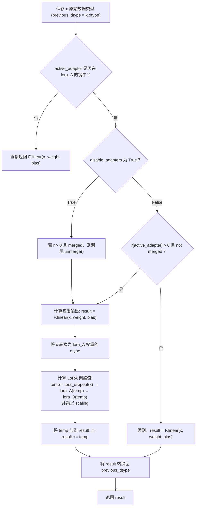

# 数学基础总结 


## 符号定义

本文使用如下统一符号体系：

- **Datasets**：训练集记为 $\mathcal{D}^{tr}=\bigl\{(\mathbf{x}_i^{tr}, y_i^{tr})\bigr\}_{i=1}^{N^{tr}}$，验证集 $\mathcal{D}^{vl}$，测试集 $\mathcal{D}^{ts}$。

- **Model**：$f(\mathbf{x}; \mathbf{w})$ 表示模型函数，参数由 $\mathbf{w}$ 表示。

- **Loss Function**：
  $$
  \mathcal{L}(\mathcal{D}; \mathbf{w}) = \frac{1}{|\mathcal{D}|} \sum_{(\mathbf{x}_i, y_i) \in \mathcal{D}} \ell\bigl(f(\mathbf{x}_i; \mathbf{w}),\, y_i\bigr),
  $$
  其中 $\ell(\cdot,\cdot)$ 可以为交叉熵等具体形式。

- **Gradient / Hessian**：
  $$
  \nabla \mathcal{L}(\mathcal{D}; \mathbf{w}), \quad \nabla^2 \mathcal{L}(\mathcal{D}; \mathbf{w})
  $$
  分别表示对 $\mathbf{w}$ 的一阶与二阶梯度。

下文将结合上述符号，简要总结各论文的核心公式推

$H=\quad \nabla^2 \mathcal{L}_{\mathcal{D}}( \mathbf{w})$

## SAM -- 两步计算梯度，超参数$\rho$


show that sharpness defined in the rigid spherical region with a fixed radius can have a weak correlation with the generalization gap due to nonidentifiability of rectifier neural networks


### 构造定义概念尖锐度


将上面式子右边重写


$$
[
\max_{\|\boldsymbol{\epsilon}\|_p \le \rho} 
\mathcal{L}\bigl(\mathcal{D}^{tr};\,\mathbf{w}+\boldsymbol{\epsilon}\bigr) 
-  
\mathcal{L}\bigl(\mathcal{D}^{tr};\,\mathbf{w}\bigr) ] 

+ h(\Vert w \Vert_2^2/\rho^2)
$$


定义尖锐度如下：
$$
[
\max_{\|\boldsymbol{\epsilon}\|_p \le \rho} 
\mathcal{L}\bigl(\mathcal{D}^{tr};\,\mathbf{w}+\boldsymbol{\epsilon}\bigr) 
-  
\mathcal{L}\bigl(\mathcal{D}^{tr};\,\mathbf{w}\bigr) ]
$$


###  设计思路

SAM 直接优化损失函数的**尖锐度（sharpness）**，目的是找到平坦极小点：
$$
\min_{\boldsymbol{\theta}} \;\max_{\|\boldsymbol{\epsilon}\|_p \le \rho}\;
   
   \mathcal{L}\bigl(\mathcal{D}^{tr};\,\boldsymbol{\theta}+\boldsymbol{\epsilon}\bigr).
$$

- 其中，$\rho$ 为扰动半径，$\|\cdot\|_p$ 通常取 $p=2$。
-  **内层最大化** $\max_{\|\epsilon\|\leq \rho} L(\theta + \epsilon)$ 计算“最坏方向”的损失变化。
- **外层最小化** $\min_{\theta}$ 则优化参数 $\theta$，使得其在局部区域内对扰动不敏感，即找到较“平坦”的极小点。

**一阶近似**
$$
\begin{aligned}
\epsilon_t^* 

& =\underset{\|\epsilon\|_p \leq \rho}{\operatorname{argmax}} L_S\left(\mathbf{w}_t+\epsilon\right) \\
& \approx arg\max_{\|\boldsymbol{\epsilon}\|\le\rho}   \Bigl\langle \nabla \mathcal{L}\bigl(\mathcal{D}^{tr}; \boldsymbol{\theta}\bigr),\,\boldsymbol{\epsilon}\Bigr\rangle   \; \\


& \Longrightarrow\   \rho \,\frac{\nabla \mathcal{L}\bigl(\mathcal{D}^{tr}; \boldsymbol{\theta}\bigr)}{\bigl\|\nabla \mathcal{L}(\mathcal{D}^{tr}; \boldsymbol{\theta})\bigr\|_2}.
\end{aligned}
$$

梯度更新则变为：

$$
\begin{aligned}
\mathbf{w}_{t+1} & =\underset{\mathbf{w}}{\arg \min } L_S\left(\mathbf{w}+\epsilon_t\right)
\\
& \approx \underset{\mathbf{w}}{\arg \min }\left(\mathbf{w}-\mathbf{w}_t\right)^{\top} \nabla L_S\left(\mathbf{w}_t+\epsilon_t\right)\\
& \approx \mathbf{w}_t-\alpha_t\nabla L_S\left(\mathbf{w}_t+\epsilon_t\right)
\end{aligned}
$$


**算法流程**

SAM 在每次梯度更新前，先计算**最坏扰动方向** $\epsilon^\ast$：
$$
\epsilon^\ast = \rho \frac{\nabla L(\theta)}{\|\nabla L(\theta)\|}.
$$
然后，在被扰动的参数 $\theta + \epsilon^\ast$ 处计算新的梯度：
$$
\theta_{t+1} = \theta_t - \eta \nabla L(\theta + \epsilon^\ast).
$$

**要点与推理**  

- 通过“最坏扰动”近似，显式地惩罚曲率尖锐区域，降低 $\nabla^2 \mathcal{L}$ 的特征值。 

### 不足

- 每次都精确求最坏扰动，相比标准SGD，多计算了 $\boldsymbol{\epsilon}^*$ 并在 $\boldsymbol{\theta}+\boldsymbol{\epsilon}^*$ 处评估梯度。

- 引入了超参数  $\rho$， 固定邻域半径对所有层与参数一视同仁

  


### 代码流程


### 可视化示意图


## SWA  --  对参数求平均值

 [**Averaging Weights Leads to Wider Optima and Better Generalization**](http://arxiv.org/abs/1803.05407) 


### 设计思路：


### 算法流程


$N_e$, and the tolerance rate $r$ for searching the start iteration $t_s$ and the end iteration $t_e$. First, we search $t_s$ which satisfies $\min _{i \in\left[0, \ldots, N_s-1\right]} \mathcal{E}_{\text {val }}^{\left(t_s+i\right)}=\mathcal{E}_{\text {val }}^{\left(t_s\right)}$, where $\mathcal{E}_{\text {val }}^{(i)}$ denotes the validation loss at iteration $i$. Simply, $\underline{t}_s$ is the first iteration where the loss value is no longer decreased during $N_s$ iterations. Then, we find $t_e$ satisfying $\min _{i \in\left[0,1, \ldots, N_e-1\right]} \mathcal{E}_{\text {val }}^{\left(t_e+i\right)}>r \mathcal{E}_{\text {val }}^{\left(t_s\right)}$. In other words, $\underline{t_e}$ is the first iteration where the validation loss values exceed the tolerance $r$ during $N_e$ iterations.

## SWAD -- 设定 求平均值的时间

SWAD ：[Domain Generalization by Seeking Flat Minima](https://proceedings.neurips.cc/paper_files/paper/2021/hash/bcb41ccdc4363c6848a1d760f26c28a0-Abstract.html)   2021 NIPS

### 设计思路 

SWAD collects the weights from the start iteration $t_s$ to the end iteration $t_e$, 

where $t_s$ and $t_e$ are obtained by monitoring the validation loss (overfit-aware scheduling).

First, we search $t_s$ which satisfies $\min _{i \in\left[0, \ldots, N_s-1\right]} \mathcal{E}_{\text {val }}^{\left(t_s+i\right)}=\mathcal{E}_{\text {val }}^{\left(t_s\right)}$, where $\mathcal{E}_{\text {val }}^{(i)}$ denotes the validation loss at iteration $i$.

 Simply, $t_s$ is the first iteration where the loss value is no longer decreased during $N_s$ iterations.

Then, we find $t_e$ satisfying $\min _{i \in\left[0,1, \ldots, N_e-1\right]} \mathcal{E}_{\text {val }}^{\left(t_e+i\right)}>r \mathcal{E}_{\text {val }}^{\left(t_s\right)}$. 

In other words, ${t_e}$ is the first iteration where the validation loss values exceed the tolerance $r$ during $N_e$ iterations.


### 可视化示意图


# 改进方向一  超参数$\rho$ 扰动半径范围


## Paper1: ASAM - 归一化扰动半径使得具有尺度不变性

### 设计思路

SAM 中 所定义的 尖锐度中的扰动半径 $\rho$是一个固定的值，如下


$$
[
\max_{\|\boldsymbol{\epsilon}\|_2 \le \rho} 
\mathcal{L}\bigl(\mathcal{D}^{tr};\,\boldsymbol{\theta}+\boldsymbol{\epsilon}\bigr) 
-  
\mathcal{L}\bigl(\mathcal{D}^{tr};\,\boldsymbol{\theta}\bigr) ]
$$


但一个固定值并不能适应所有情况，尤其是网络的参数尺度不一致的时候如下：
$$
\max_{\|\boldsymbol{\epsilon}\|_2 \le \rho} 
\mathcal{L}\bigl(\mathcal{D}^{tr};\,\boldsymbol{\theta}+\boldsymbol{\epsilon}\bigr)  \neq  
\max_{\|\boldsymbol{\epsilon}\|_2 \le \rho} 
\mathcal{L}\bigl(\mathcal{D}^{tr};\,A\boldsymbol{\theta}+\boldsymbol{\epsilon}\bigr)
$$


所以作者提出应该是一个归一化的值


- 改进点：将 $\|\boldsymbol{\epsilon}\|\le\rho$ 换成 $\|\mathbf{T}_{\mathbf{w}}^{-1}\boldsymbol{\epsilon}\|\le\rho$，其中 $\mathbf{T}_{\mathbf{w}}$ 为可根据层或参数尺度自适应的算子。
  $$
  \max_{\|\mathbf{T}_{\mathbf{w}}^{-1}\boldsymbol{\epsilon}\|\le\rho} \mathcal{L}\bigl(\mathcal{D}^{tr};\, \mathbf{w} + \boldsymbol{\epsilon}\bigr).
  $$

- 实际更新近似：
  $$
  \boldsymbol{\epsilon}^* \approx \rho\, \mathbf{T}_{\mathbf{w}}\, \frac{\nabla\mathcal{L}(\mathcal{D}^{tr}; \mathbf{w})}{\|\mathbf{T}_{\mathbf{w}}\nabla\mathcal{L}(\mathcal{D}^{tr}; \mathbf{w})\|}.
  $$

- 解决了 SAM 对参数缩放敏感的问题，让锐度度量具备尺度不变性。


### 算法流程图


### 可视化示意图


## Paper 2: LETS   令扰动半径 $\rho$ 成为可学习参数

### 尖锐度度量选择


$$
\frac{1}{2}\left(\mathcal{L}\left(\mathcal{D}^{v l} ; \mathbf{w}^{\star}(\rho)\right)-\mathcal{L}\left(\mathcal{D}^{t r} ; \mathbf{w}^{\star}(\rho)\right)\right)^2
$$
训练集和验证集的 训练损失 均方误差


### 设计思路

- 令扰动半径 $\rho$ 成为可学习参数：  
  $$
  \rho \leftarrow \rho - \gamma \,\nabla_{\rho} \Bigl[\max_{\|\boldsymbol{\epsilon}\|\le\rho} \mathcal{L}(\mathcal{D}^{tr}; \mathbf{w} + \boldsymbol{\epsilon})\Bigr].
  $$

- 或以双层优化形式：外层更新 $\mathbf{w}$，内层更新 $\rho$，使得训练中 $\rho$ 能动态自适应数据与阶段变化。

### 算法流程图


# 改进方向二 使用不同的度量来近似误差替代二次梯度计算


## Paper 1 :  -用随机近似替代精确最坏扰动

用随机近似替代精确最坏扰动：
$$
\boldsymbol{\epsilon}^* \approx \underset{\boldsymbol{\delta}\in\{\boldsymbol{\delta}_1,\dots,\boldsymbol{\delta}_k\}}{\arg\max} \ \mathcal{L}\bigl(\mathcal{D}^{tr};\, \mathbf{w} + \boldsymbol{\delta}\bigr),
$$
其中 $\boldsymbol{\delta}_i$ 为随机采样到的扰动向量，不再严格沿梯度方向。


approximation $\epsilon^*$ instead of gradient calculation


## Paper2 :SAF  通过轨迹损失 (Trajectory Loss) 替代 sharpness 损失

### 尖锐度度量选择


SAF 通过**引入轨迹损失 (Trajectory Loss)** 来替代 sharpness 计算，降低计算成本。轨迹损失基于**KL 散度 (Kullback-Leibler Divergence, KL-divergence)**，定义如下：


$$
L_{\text{tra}}(f_{\theta}, Y^{(e-\tilde{E})}) = \frac{\lambda}{|B|} \sum_{x_i \in B} KL\left(\frac{1}{\tau} y_i^{(e-\tilde{E})}, \frac{1}{\tau} f_{\theta}(x_i)\right)
$$
其中：

- $y_i^{(e-\tilde{E})}$ 表示**E 轮前的网络输出**，用于构建轨迹损失。
- $\tau$ 是温度超参数，控制 KL 散度的平滑程度。

**核心思路：**

- **SAF 记录模型训练过程中过去的输出**，并在更新时最小化历史输出与当前输出之间的 KL 散度。
- **避免了额外的梯度计算**，减少计算开销。


#### **3.3 MESA（Memory-Efficient SAF）**

MESA 进一步优化 SAF，在大规模数据集上减少内存开销：

- 采用指数移动平均 (EMA)计算轨迹损失：

  $$
  v_t = \beta v_{t-1} + (1-\beta) \theta_t
  $$
  
- 轨迹损失采用 EMA 计算：

  $$
  L_{\text{tra}}(f_{\theta}, f_{v_t}) = \frac{1}{|B|} \sum_{x_i \in B} KL\left(\frac{1}{\tau} f_{v_t}(x_i), \frac{1}{\tau} f_{\theta}(x_i)\right)
  $$
  
- 这样，**EMA 平滑了模型权重**，减少了内存消耗，并在不增加计算复杂度的情况下保持 SAF 的优势。


### 算法流程


## LPF-SGD (Low-Pass Filtering SGD) - 在每步更新中，对梯度做时序低通滤波

- 在每步更新中，对梯度做时序低通滤波：
  $$
  \tilde{g}_t = \alpha \tilde{g}_{t-1} + (1-\alpha) \nabla \mathcal{L}(\mathcal{D}^{tr}; \mathbf{w}_t),
  $$

  $$
  \mathbf{w}_{t+1} = \mathbf{w}_t - \eta \,\tilde{g}_t.
  $$

- 此平滑操作从信号处理角度减少对尖锐方向的过度拟合


### 对于 sharpness 的度量


### 算法流程


# 改进方向三 减少计算频率，周期性/间歇式测量锐度

##  RST : 每步以概率$p(t)$随机决定是否使用 SAM

- 主要思想：在训练过程中动态决定是否执行 SAM 步骤/或执行多大扰动。

- 模型可写为类似：
  $$
  \mathbf{w}_{t+1} = \mathbf{w}_t - \eta\, \Bigl[\nabla \mathcal{L}\bigl(\mathcal{D}^{tr}; \mathbf{w}_t\bigr)\,\mathbf{1}_{\text{no-SAM}} + \nabla \mathcal{L}\bigl(\mathcal{D}^{tr}; \mathbf{w}_t + \boldsymbol{\epsilon}_t^*\bigr)\,\mathbf{1}_{\text{SAM}}\Bigr].
  $$

- 这里的 $\mathbf{1}_{(\cdot)}$ 表示根据某策略决定执行与否。

### 算法流程


##  LookSAM - 每 k 轮执行 SAM

- 核心：仅周期性地执行一次 SAM 的内层扰动；形式与普通 SAM 相同，但在大多数 step 没有计算 $\max_{\|\boldsymbol{\epsilon}\|\le\rho}$。

- 令训练分块 $(t_1, t_2,\dots)$，只在区间端点处执行：
  $$
  \boldsymbol{\epsilon}^{(k)} = \rho\, \frac{\nabla \mathcal{L}(\mathcal{D}^{tr}; \mathbf{w}^{(k)})}{\|\nabla \mathcal{L}(\mathcal{D}^{tr}; \mathbf{w}^{(k)})\|}.
  $$

- 其余步只做常规梯度下降。


### 算法流程


### 示意图


## AE-SAM - 仅在锐利区域执行 SAM


### 尖锐度度量选择 -- 梯度范数的平方

使用梯度范数的平方$\|\nabla L(B_t; w_t)\|^2$作为衡量损失曲面锐利度的指标


### 算法流程


###  SSAM -基于信息矩阵或者动态稀疏来分配掩码只影响最重要的参数


# 改进方向四 结合LoRA方法


 SAM 的扰动可视为隐式正则


## BAR -  定义平衡性

### 定义概念 平衡度 

$α_t(x^Tx - y^Ty)$


# 理论阐述


## Towards Understanding Sharpness-Aware Minimization

**SAM 的隐式正则化效应 (Implicit Regularization)**：在**对角线线性网络 (diagonal linear networks)** 设定下，SAM 对解的选择具有独特的隐式偏差，能够**偏向稀疏解 (sparse solutions)**，从而提高泛化能力

##  Why Does Sharpness-Aware Minimization Generalize Better Than SGD?

**SAM 解决方案**：

- SAM 每次更新前 **先计算梯度方向的扰动**：
  $$
  \epsilon = \tau \frac{\nabla L(W)}{\|\nabla L(W)\|}.
  $$

- 通过这样的扰动，SAM **主动抑制了噪声梯度的影响**，使得网络能更专注于学习信号

  

作者指出 **SAM** 在每一次更新时插入权重扰动，会主动把原本会学习到噪声的神经元“关掉”，从而减少网络对噪声的过度拟合。


| #                                                            | 论文标题                                                     | 发表时间                                                     | 期刊/会议                                                    | 论文类型                                                    | 主要创新点                                                   | 方法简要总结                                                 | 文章核心公式                        | 关于 Flat Minima / 尖锐度的度量或定义              | 不足/局限 |
| ------------------------------------------------------------ | ------------------------------------------------------------ | ------------------------------------------------------------ | ------------------------------------------------------------ | ----------------------------------------------------------- | ------------------------------------------------------------ | ------------------------------------------------------------ | ----------------------------------- | -------------------------------------------------- | --------- |
| 1                                                            | **SAM: Sharpness-Aware Minimization for Efficiently Improving Generalization** | 2021                                                         | ICLR                                                         | **原始论文**                                                | 在每步更新时考虑参数邻域内的最坏扰动 ( \(\Vert \boldsymbol{\epsilon}\Vert \le \rho\) ), 以显式抑制尖锐极小值 | 基于 Min-Max 框架：先用一次近似找到 \(\boldsymbol{\epsilon}^* \approx \rho \tfrac{\nabla \mathcal{L}}{\Vert \nabla \mathcal{L}\Vert}\)，再在 \(\mathbf{w} + \boldsymbol{\epsilon}^*\) 处计算梯度并更新 | 如下式：                            |                                                    |           |
| $ \min_{\mathbf{w}} \Bigl[\max_{\Vert \boldsymbol{\epsilon}\Vert \le \rho} \mathcal{L}(\mathcal{D}^{tr}; \mathbf{w} + \boldsymbol{\epsilon})\Bigr] $ | 通过 $ \max_{\Vert \boldsymbol{\epsilon}\Vert \le \rho} $ 来定义/度量尖锐度；若局部曲率高则此扰动会极大增损失 | (1) 计算量约为常规 SGD 的两倍                                |                                                              |                                                             |                                                              |                                                              |                                     |                                                    |           |
| (2) 超参数 \( \rho \) 需手动调优                             |                                                              |                                                              |                                                              |                                                             |                                                              |                                                              |                                     |                                                    |           |
| 2                                                            | **SWA: Averaging Weights Leads to Wider Optima and Better Generalization** | 2018 (arXiv)                                                 | ArXiv                                                        | **原始论文**                                                | 提出在训练后期对不同迭代点权重进行平均，可寻找更平坦的极小值 | 在训练后期保持一个权重均值：                                 |                                     |                                                    |           |
| $ \mathbf{w}_{\text{SWA}} = \frac{1}{K}\sum_{k=1}^K \mathbf{w}^{(k)} $  ，几乎无额外梯度开销 | $ \mathbf{w}_{\text{SWA}} = \tfrac{1}{K}\sum_{k=1}^K \mathbf{w}^{(k)} $ | 以权重平均降低 Hessian 最大特征值，从而实现平坦化            | 需对 BN 统计重新估计；仅对后期训练效果更佳                   |                                                             |                                                              |                                                              |                                     |                                                    |           |
| 3                                                            | **ASAM: Adaptive Sharpness-Aware Minimization**              | 2022 (推测)                                                  | -                                                            | **论文改进方向2：使用不同的度量来近似误差替代二次梯度计算** | 将球形邻域 \( \Vert \boldsymbol{\epsilon}\Vert \le \rho\) 替换为 \( \Vert \mathbf{T}_{\mathbf{w}}^{-1}\boldsymbol{\epsilon}\Vert \le \rho\)，从而具备尺度不变性 | 在 SAM 中加入可自适应算子 \( \mathbf{T}_{\mathbf{w}} \)，避免某些层因参数量级较大或较小而受到过度或不足扰动 |                                     |                                                    |           |
| $ \max_{\Vert \mathbf{T}_{\mathbf{w}}^{-1}\boldsymbol{\epsilon}\Vert \le \rho} \;\mathcal{L}(\mathcal{D}^{tr}; \mathbf{w} + \boldsymbol{\epsilon}) $ | 将邻域由“固定球”改为“自适应归一化”邻域，以减少对参数缩放的敏感 | 仍需要两次梯度计算；需合理设计 \( \mathbf{T}_{\mathbf{w}} \) 的结构 |                                                              |                                                             |                                                              |                                                              |                                     |                                                    |           |
| 4                                                            | **SWAD: Domain Generalization by Seeking Flat Minima**       | 2021 (NeurIPS)                                               | NeurIPS                                                      | **论文改进方向2：使用不同的度量来近似**                     | 将 SWA 思想推广到多域训练，对不同域与不同阶段的权重进行平均，寻找跨域平坦极小值 | 在多域场景下，对多个域的综合损失                             |                                     |                                                    |           |
| $ \mathcal{L}_{\text{DG}}(\mathbf{w}) = \sum_j \alpha_j \mathcal{L}(\mathcal{D}_j; \mathbf{w}) $ |                                                              |                                                              |                                                              |                                                             |                                                              |                                                              |                                     |                                                    |           |
| 用 SWA 方式做权重平均，以达到在未知域上也更好泛化            |                                                              |                                                              |                                                              |                                                             |                                                              |                                                              |                                     |                                                    |           |
| $ \mathbf{w}_{\text{SWAD}} = \frac{1}{K}\sum_{k=1}^K \mathbf{w}^{(k)} , \quad (\text{across multiple domains}) $ | 依靠多次权重平均降低曲率，使解在所有域附近都更平滑           | 若域间分布差异极大，简单平均可能不足                         |                                                              |                                                             |                                                              |                                                              |                                     |                                                    |           |
| 5                                                            | **LookSAM: Towards Efficient and Scalable Sharpness-Aware Minimization** | 2022 (CVPR)                                                  | CVPR                                                         | **论文改进方向3：减少计算频率，周期性/间歇式测量锐度**      | 并非每一步都计算 SAM 的最坏扰动，仅在周期性时刻做一次完整计算，从而降低额外开销 | 将训练分成若干段，仅在段末执行                               |                                     |                                                    |           |
| $ \boldsymbol{\epsilon}^* \!= \rho \,\frac{\nabla \mathcal{L}(\mathbf{w}_{t_k})}{\Vert \nabla \mathcal{L}(\mathbf{w}_{t_k})\Vert} $ |                                                              |                                                              |                                                              |                                                             |                                                              |                                                              |                                     |                                                    |           |
| 其余时刻按常规 SGD；可大幅减少二次 forward-backward 次数     | 仍沿用 SAM 的                                                |                                                              |                                                              |                                                             |                                                              |                                                              |                                     |                                                    |           |
| $ \max_{\Vert \boldsymbol{\epsilon}\Vert \le \rho} $         |                                                              |                                                              |                                                              |                                                             |                                                              |                                                              |                                     |                                                    |           |
| 只是在时间上减少频次                                         | 尖锐度度量方式与 SAM 相同；但减少执行频率以提升效率          | 效果依赖“间隔”超参；大规模分布式环境需进一步验证             |                                                              |                                                             |                                                              |                                                              |                                     |                                                    |           |
| 6                                                            | **SSAM: Make Sharpness-Aware Minimization Stronger via a Sparsified Perturbation** | 2022 (NeurIPS)                                               | NeurIPS                                                      | **论文改进方向2：使用不同的度量来近似**                     | 在全参空间中仅对关键维度施加最坏扰动，实现稀疏扰动以减少计算负担 | 基于稀疏掩码 \( \mathbf{m} \)，只对被标记为 1 的维度进行     |                                     |                                                    |           |
| $ \max_{\Vert \mathbf{m}\cdot\boldsymbol{\epsilon}\Vert \le \rho} \mathcal{L}(\mathcal{D}^{tr}; \mathbf{w} + \mathbf{m}\cdot\boldsymbol{\epsilon}) $ |                                                              |                                                              |                                                              |                                                             |                                                              |                                                              |                                     |                                                    |           |
| ，掩码可静态/动态                                            |                                                              |                                                              |                                                              |                                                             |                                                              |                                                              |                                     |                                                    |           |
| $ \max_{\Vert \mathbf{m}\cdot \boldsymbol{\epsilon}\Vert \le\rho} \;\mathcal{L}\bigl(\mathbf{w} + \mathbf{m}\cdot \boldsymbol{\epsilon}\bigr) $ | 仍以球形邻域度量尖锐度，但只在子空间执行                     | 稀疏方式和掩码选取需要额外调优；对小网络或低维场景收益有限   |                                                              |                                                             |                                                              |                                                              |                                     |                                                    |           |
| 7                                                            | **An Adaptive Policy to Employ Sharpness-Aware Minimization** | -                                                            | -                                                            | **论文改进方向3：减少计算频率**                             | 动态策略：根据训练情况确定是否执行 SAM 扰动或仅做常规更新    | 若策略判断需 SAM，则                                         |                                     |                                                    |           |
| $ \mathbf{w} \leftarrow \mathbf{w} - \eta\, \nabla \mathcal{L}\bigl(\mathbf{w} + \boldsymbol{\epsilon}^*\bigr); \quad |                                                              |                                                              |                                                              |                                                             |                                                              |                                                              |                                     |                                                    |           |
| \boldsymbol{\epsilon}^* = \rho\,\frac{\nabla \mathcal{L}(\mathbf{w})}{\Vert\nabla \mathcal{L}(\mathbf{w})\Vert} $ |                                                              |                                                              |                                                              |                                                             |                                                              |                                                              |                                     |                                                    |           |
| 否则普通 SGD；可减少二次梯度频次                             | 仍是                                                         |                                                              |                                                              |                                                             |                                                              |                                                              |                                     |                                                    |           |
| $ \max_{\Vert \boldsymbol{\epsilon}\Vert \le \rho} $         |                                                              |                                                              |                                                              |                                                             |                                                              |                                                              |                                     |                                                    |           |
| ，只是在训练流程中控制是否执行                               | 定义了与 SAM 相同的邻域尖锐度，但通过启发式管理“执行时机”    | 策略设计或判定不准会削弱最终效果                             |                                                              |                                                             |                                                              |                                                              |                                     |                                                    |           |
| 8                                                            | **SAF: Sharpness-Aware Training for Free**                   | -                                                            | -                                                            | **论文改进方向2：使用不同的度量来近似**                     | 借鉴 Free Adversarial Training，将“最坏扰动”过程与单次反向传播合并，实现近似的 SAM 效果 | 采用单次反传同时更新 \(\boldsymbol{\epsilon}\) 和 \(\mathbf{w}\)，不必显式做两次 forward-backward： |                                     |                                                    |           |
| $ \boldsymbol{\epsilon}_t \leftarrow \boldsymbol{\epsilon}_{t-1} + \alpha\,\nabla_{\boldsymbol{\epsilon}}\ell(\mathbf{w}+\boldsymbol{\epsilon}),\ |                                                              |                                                              |                                                              |                                                             |                                                              |                                                              |                                     |                                                    |           |
| \mathbf{w}\leftarrow \mathbf{w}-\eta\nabla_{\mathbf{w}}\ell(\mathbf{w}+\boldsymbol{\epsilon}_t) $ | 将原来                                                       |                                                              |                                                              |                                                             |                                                              |                                                              |                                     |                                                    |           |
| $ \max_{\Vert \boldsymbol{\epsilon}\Vert\le\rho} $           |                                                              |                                                              |                                                              |                                                             |                                                              |                                                              |                                     |                                                    |           |
| 的内循环替换为一次近似式的同步更新                           | 依旧测度局部曲率，但只做“一次更新”近似最坏扰动               | 与真正 SAM 差异较大，曲率极端场景下易不精确                  |                                                              |                                                             |                                                              |                                                              |                                     |                                                    |           |
| 9                                                            | **LPF-SGD: Low-Pass Filtering SGD**                          | 2022 (AISTATS)                                               | AISTATS                                                      | **论文改进方向2：使用不同的度量来近似**                     | 对梯度时序进行低通滤波，平滑掉短期高频噪声，从而间接降低尖锐度 | 每步更新时：                                                 |                                     |                                                    |           |
| $ \tilde{g}_t = \alpha\,\tilde{g}_{t-1} + (1-\alpha)\,\nabla\mathcal{L}(\mathbf{w}_t),\quad |                                                              |                                                              |                                                              |                                                             |                                                              |                                                              |                                     |                                                    |           |
| \mathbf{w}_{t+1} = \mathbf{w}_t - \eta\,\tilde{g}_t $        |                                                              |                                                              |                                                              |                                                             |                                                              |                                                              |                                     |                                                    |           |
| ，减少对陡峭方向的过拟合                                     | 通过滤除高频梯度干扰，实现对尖锐极小值的回避                 | 间接定义尖锐度：不再显式 \(\max_{\Vert \boldsymbol{\epsilon}\Vert \le \rho}\)，而是用梯度平滑抗曲率 | 滤波系数 \(\alpha\) 的选择敏感；在多模态或大网络中需更多试验 |                                                             |                                                              |                                                              |                                     |                                                    |           |
| 10                                                           | **LETS: Enhancing Sharpness-Aware Minimization by Learning Perturbation Radius** | 2024 (ECML PKDD)                                             | ECML PKDD                                                    | **论文改进方向1：超参数 $ \rho $ 扰动半径范围**             | 让 $ \rho $ 不再固定，而是可学习或由双层优化确定，可随着训练动态调整 | 在 SAM 的                                                    |                                     |                                                    |           |
| $ \max_{\Vert \boldsymbol{\epsilon}\Vert\le \rho} \mathcal{L}(\mathbf{w}+\boldsymbol{\epsilon}) $ |                                                              |                                                              |                                                              |                                                             |                                                              |                                                              |                                     |                                                    |           |
| 中视 $ \rho(\theta) $ 为自适应量；可用元学习公式或交替优化实现 |                                                              |                                                              |                                                              |                                                             |                                                              |                                                              |                                     |                                                    |           |
| $ \rho \leftarrow \rho - \gamma\,\nabla_{\rho}\Bigl[\max_{\Vert \boldsymbol{\epsilon}\Vert \le\rho} \mathcal{L}(\mathbf{w}+\boldsymbol{\epsilon})\Bigr] $ | 尖锐度依旧通过球形邻域定义，但 $ \rho $ 是动态可调           | 带来额外双层优化的计算与超参；实现相对复杂                   |                                                              |                                                             |                                                              |                                                              |                                     |                                                    |           |
| 11                                                           | **RST: Randomized Sharpness-Aware Training**                 | -                                                            | -                                                            | **论文改进方向2：使用不同的度量来近似**                     | 用随机若干向量近似最坏扰动，不再严格沿梯度方向，减少二次计算 | 例如：抽取 $ k $ 个随机向量 $ \{\boldsymbol{\delta}_i\}_{i=1}^k $，选损失增量最大的 $ \boldsymbol{\epsilon}^* \approx \boldsymbol{\delta}_{j} $；只需一次或少量的 forward 评估即可完成近似 |                                     |                                                    |           |
| $ \boldsymbol{\epsilon}^* \approx \underset{\boldsymbol{\delta}\in\{\boldsymbol{\delta}_1,\dots,\boldsymbol{\delta}_k\}}{\mathrm{argmax}}\;\mathcal{L}\bigl(\mathbf{w}+\boldsymbol{\delta}\bigr) $ | 仍遵循 $ \max_{\Vert \boldsymbol{\epsilon}\Vert\le\rho}\!$ 的结构，但改用随机搜索估计 | 随机抽样数需合适；在高维度中仍可能低效或不准确               |                                                              |                                                             |                                                              |                                                              |                                     |                                                    |           |
| 12                                                           | **Flat Minima Generalize for Low-Rank Matrix Recovery**      | 2024 (IMA)                                                   | IMA                                                          | **改进方向4：结合 LoRA 方法**                               | 从理论层面分析低秩子空间的平坦解对噪声和缺失具有更强鲁棒性   | 考虑低秩约束 $ \mathrm{rank}(\mathbf{W}) \le r $，基于 Hessian 分析和二阶展开说明平坦极小值有助于在矩阵补全等任务中保持泛化 | 无具体 SAM/SWA 公式；主要研究       |                                                    |           |
| $ \min_{\mathrm{rank}(\mathbf{W})\le r}\mathcal{L}(\mathcal{D}^{tr};\,\mathbf{W}) $ |                                                              |                                                              |                                                              |                                                             |                                                              |                                                              |                                     |                                                    |           |
| 的 Hessian 性质                                              | “平坦极小值”在低秩空间中更稳健地重构结构                     | 多为理论推导和小规模实验；尚需更大数据及应用验证             |                                                              |                                                             |                                                              |                                                              |                                     |                                                    |           |
| 13                                                           | **Implicit Regularization of Sharpness-Aware Minimization for Scale-Invariant Problems** | 2024 (NeurIPS)                                               | NeurIPS                                                      | **理论分析**                                                | 对具备“尺度不变”性质的任务，指出 SAM 的最坏扰动会隐式诱导更低范数解 | 仍基于                                                       |                                     |                                                    |           |
| $ \max_{\Vert \boldsymbol{\epsilon}\Vert\le\rho} \mathcal{L}(\mathbf{w} + \boldsymbol{\epsilon}) $ ， |                                                              |                                                              |                                                              |                                                             |                                                              |                                                              |                                     |                                                    |           |
| 当目标在 $ \alpha\,\mathbf{w} $ 与 $ \mathbf{w} $ 等效时，SAM 会倾向选择范数更小的解 | 与 SAM 同样使用邻域最大损失定义尖锐度，但讨论其隐式正则化效应 | 偏理论，缺少面向大规模模型的实证                             |                                                              |                                                             |                                                              |                                                              |                                     |                                                    |           |
| 14                                                           | **FLAT-LORA: Low-Rank Adaptation over a Flat Loss Landscape** | 2024 (ArXiv)                                                 | ArXiv                                                        | **改进方向4：结合 LoRA 方法**                               | 将 SAM/SWA 思想应用于大模型微调中的 LoRA 子空间，从而减少全参扰动开销 | 在大模型的 LoRA 低秩子空间执行类似                           |                                     |                                                    |           |
| $ \max_{\Vert \boldsymbol{\epsilon}\Vert \le\rho}\!\mathcal{L}\bigl(\mathbf{W}_0 + \Delta \mathbf{W} + \boldsymbol{\epsilon}\bigr) $ |                                                              |                                                              |                                                              |                                                             |                                                              |                                                              |                                     |                                                    |           |
| ，冻结主干，聚焦低秩参数以节省算力                           | 同 SAM，但把扰动局限在 LoRA 子空间                           |                                                              |                                                              |                                                             |                                                              |                                                              |                                     |                                                    |           |
| (  $ \Vert \Delta \mathbf{W}\Vert \!<\! \infty $, rank$<r$ ) | 合并回主干时仍可能处于全参空间的局部尖锐，需设计更完善策略   | 实现中需处理 LoRA 低秩限制与 SAM 双重开销                    |                                                              |                                                             |                                                              |                                                              |                                     |                                                    |           |
| 15                                                           | **Towards Understanding Sharpness-Aware Minimization**       | 2022 (ICML)                                                  | ICML                                                         | **理论分析**                                                | 通过二阶泰勒展开和 Hessian 光谱解析，说明 SAM 抑制最大特征值导致更好泛化 | 对                                                           |                                     |                                                    |           |
| $ \mathcal{L}(\mathbf{w} + \boldsymbol{\epsilon}) \approx \mathcal{L}(\mathbf{w}) + \nabla \mathcal{L}(\mathbf{w})^\top \boldsymbol{\epsilon} + \tfrac12 \boldsymbol{\epsilon}^\top \nabla^2 \mathcal{L}(\mathbf{w})\boldsymbol{\epsilon} $ |                                                              |                                                              |                                                              |                                                             |                                                              |                                                              |                                     |                                                    |           |
| 做深入分析                                                   | 以 $ \max_{\Vert \boldsymbol{\epsilon}\Vert\le\rho}$ 的曲率约束来度量尖锐度 | 主要是机制阐释，无针对大规模效率改进等方案                   |                                                              |                                                             |                                                              |                                                              |                                     |                                                    |           |
| 16                                                           | **Why Does Sharpness-Aware Minimization Generalize Better Than SGD?** | 2023 (NeurIPS)                                               | NeurIPS                                                      | **理论分析**                                                | 深入比较 SAM 与普通 SGD，结合 PAC-Bayes 或 Hessian 等视角，证明 SAM 可显式避开尖锐极小值 | 仍采用                                                       |                                     |                                                    |           |
| $ \max_{\Vert \boldsymbol{\epsilon}\Vert \le\rho} \mathcal{L}(\mathbf{w} + \boldsymbol{\epsilon}) $ |                                                              |                                                              |                                                              |                                                             |                                                              |                                                              |                                     |                                                    |           |
| ，指出与 SGD 的一阶更新在概念上差异                          | 以局部最坏扰动区分平坦区与尖锐区，从而提高泛化               | 注重对比实验，未提出新改进算法                               |                                                              |                                                             |                                                              |                                                              |                                     |                                                    |           |
| 17                                                           | **When Do Flat Minima Optimizers Work?**                     | 2022 (NeurIPS)                                               | NeurIPS                                                      | **理论分析**                                                | 系统实验评估 SWA、SAM 等在不同数据规模、模型结构下的表现，归纳适用场景 | 采用 Hessian 或曲面可视化比较 \(\mathbf{w}_{\text{SWA}}, \mathbf{w}_{\text{SAM}}, \mathbf{w}_{\text{SGD}}\) 等解的平坦程度 | 基于 Hessian 光谱或插值实验衡量曲率 | 仅在公开数据集和中规模测试；大规模真实场景仍待验证 |           |
| 18                                                           | **Revisiting Catastrophic Forgetting in Large Language Model Tuning** | -                                                            | -                                                            | **理论分析**                                                | 将平坦极小值思路引入 LLM 多任务或增量微调，缓解因新数据微调而遗忘旧数据 | 在                                                           |                                     |                                                    |           |
| $ \min \bigl[\mathcal{L}(\mathcal{D}^{\mathrm{old}};\mathbf{w}) + \mathcal{L}(\mathcal{D}^{\mathrm{new}};\mathbf{w}) + \text{(flatness term)}\bigr] $ |                                                              |                                                              |                                                              |                                                             |                                                              |                                                              |                                     |                                                    |           |
| 中加入类似 SAM/SWA 的正则，对新旧任务保持兼顾                | 平坦度通常仍可用 $ \max_{\Vert \boldsymbol{\epsilon}\Vert \le \rho}$ 或 Hessian 最大特征值为度量 | 主要关注遗忘机理，对具体二次计算/内存等问题无新的优化对策    |                                                              |                                                             |                                                              |                                                              |                                     |                                                    |           |


Our balancedness-aware regularization (BAR) is a highly efficient approach to address both concerns, and it fixes the accuracy drop of LoRA relative to full-parameter finetuning. BAR is also the first efficient SAM variant derived from implicit regularization. The key observation for our algorithm design is that SAM’s implicit regularization on balancedness can be achieved with an explicit regularizer αt|x>x − y>y|.


. In this paper, we propose Flat-LoRA, an efficient approach that seeks a low-rank adaptation located in a flat region of the full parameter space. Instead of relying on the wellestablished sharpness-aware minimization approach, which can incur significant computational and memory burdens, we utilize random weight perturbation with a Bayesian expectation loss objective to maintain training efficiency and design a refined perturbation generation strategy for improved performance. Experiments on natural language processing and image classification tasks with various architectures demonstrate the effectiveness of our approach.


下面给出原始版本和修改后版本 forward 函数的流程示意图，以便更直观地理解各个分支的执行流程。

────────────────────────────── 【原始版本流程图】

```mermaid
flowchart TD
    A[保存 x 原始数据类型 (previous_dtype = x.dtype)]
    B{active_adapter 是否在 lora_A 的键中？}
    C[直接返回 F.linear(x, weight, bias)]
    D{disable_adapters 为 True？}
    E[若 r > 0 且 merged，则调用 unmerge()]
    F[计算基础输出: result = F.linear(x, weight, bias)]
    G{r[active_adapter] > 0 且 not merged？}
    H[将 x 转换为 lora_A 权重的 dtype]
    I[计算 LoRA 调整值: \n temp = lora_dropout(x) → lora_A(temp) → lora_B(temp) \n 并乘以 scaling]
    J[将 temp 加到 result 上: result += temp]
    K[否则，result = F.linear(x, weight, bias)]
    L[将 result 转换回 previous_dtype]
    M[返回 result]

    A --> B
    B -- 否 --> C
    B -- 是 --> D
    D -- True --> E
    E --> F
    D -- False --> G
    G -- 是 --> F
    F --> H
    H --> I
    I --> J
    G -- 否 --> K
    J --> L
    K --> L
    L --> M
```

说明：

1. 首先保存输入数据类型；
2. 若 active_adapter 不在 lora_A 中，则直接调用 F.linear 返回输出；
3. 如果 disable_adapters 为 True，则在必要时解除合并（merged 状态）后，仅进行基础线性计算；
4. 当启用 adapter 且 r>0 且未合并时，先计算基础输出，再将经过 dropout、低秩变换（lora_A 和 lora_B）得到的调整项加到基础输出上；
5. 最后恢复原始数据类型返回结果。
    （参考源码 citeturn0file2）

────────────────────────────── 【修改后版本流程图】

```mermaid
flowchart TD
    A1[保存 x 原始数据类型 (previous_dtype = x.dtype)]
    B1{active_adapter 是否在 lora_A 的键中？}
    C1[直接返回 F.linear(x, weight, bias)]
    D1{disable_adapters 为 True？}
    E1[若 r > 0 且 merged，则调用 unmerge()]
    F1[计算基础输出: result = F.linear(x, weight, bias)]
    G1{r[active_adapter] > 0 且 not merged？}
    H1[将 x 转换为 lora_A 权重的 dtype]
    I1[对 x 应用 lora_dropout: x_dropout = lora_dropout(x)]
    J1[计算第1个 LoRA 调整项: \n temp1 = lora_A(x_dropout) → lora_B(temp1) \n × scaling]
    K1[将 temp1 加到 result 上: result += temp1]
    L1[计算第2个 LoRA 调整项: \n temp2 = loranew_A(x_dropout) → loranew_B(temp2) \n × scaling]
    M1[将 temp2 加到 result 上: result += temp2]
    N1[否则，result = F.linear(x, weight, bias)]
    O1[将 result 转换回 previous_dtype]
    P1[返回 result]

    A1 --> B1
    B1 -- 否 --> C1
    B1 -- 是 --> D1
    D1 -- True --> E1
    E1 --> F1
    D1 -- False --> G1
    G1 -- 是 --> F1
    F1 --> H1
    H1 --> I1
    I1 --> J1
    J1 --> K1
    K1 --> L1
    L1 --> M1
    G1 -- 否 --> N1
    M1 --> O1
    N1 --> O1
    O1 --> P1
```

说明：

1. 与原始版本相同，首先保存输入数据类型，并判断 active_adapter 是否存在；
2. disable_adapters 为 True 时，同样只进行基础计算；
3. 在 adapter 激活且未合并的情况下，先转换 x 的数据类型，然后对 x 应用 dropout 得到 x_dropout；
4. 随后分两步计算调整项：
   - 第一项：利用原有的 lora_A 与 lora_B 计算贡献；
   - 第二项（新增）：利用新增的 loranew_A 与 loranew_B 计算额外贡献；
5. 两项调整值均乘以相同的 scaling 后累加到基础输出上；
6. 最后将结果转换回原始数据类型返回。
    （参考修改后源码 citeturn0file3）

────────────────────────────── 通过以上流程图，可以清楚地看到修改后版本在原有基础上新增了对第二组低秩参数（loranew_A 和 loranew_B）的计算分支，从而在输出结果中加入了额外的调整项。这样的改动旨在实现参数拆分或扩展，为模型的适配提供更丰富的参数组合。


