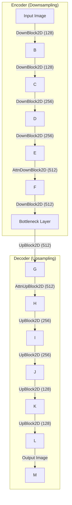

# Diffusion Model 

[GitHub - huggingface/diffusers: 🤗 Diffusers: State-of-the-art diffusion models for image, video, and audio generation in PyTorch and FLAX.](https://github.com/huggingface/diffusers)

[使用Diffusers来实现Stable Diffusion 🧨](https://huggingface.co/blog/zh/stable_diffusion)

[“Snippets: Importing libraries”的副本 - Colab](https://colab.research.google.com/drive/1HT5ZXXRJOcPJSnxu00mlP9KkitAw4-Lx)

[“diffusers_training_example.ipynb”的副本 - Colab](https://colab.research.google.com/drive/1U-5oadm1cqCWYtg5qqECEYA1fkDNtgzv)

wget https://repo.anaconda.com/miniconda/Miniconda3-latest-Linux-x86_64.sh -O ~/miniconda.sh

